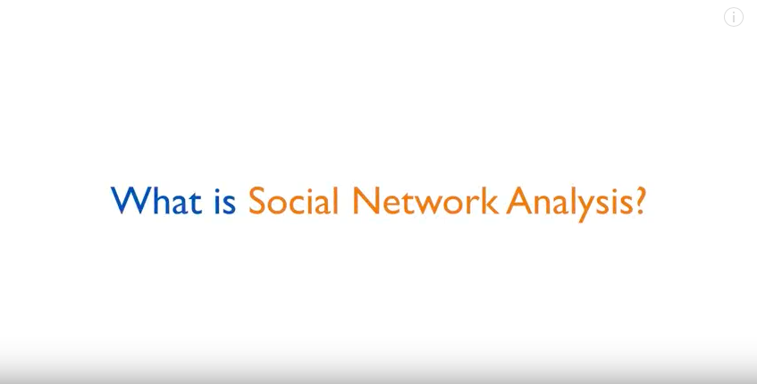
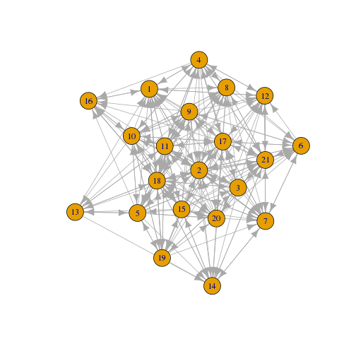
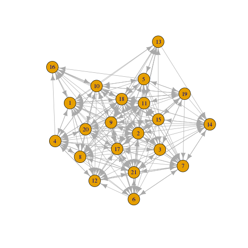
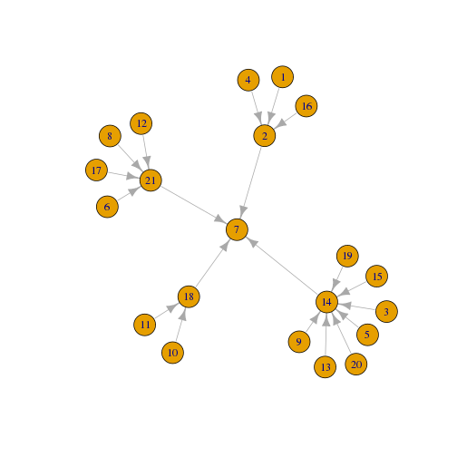
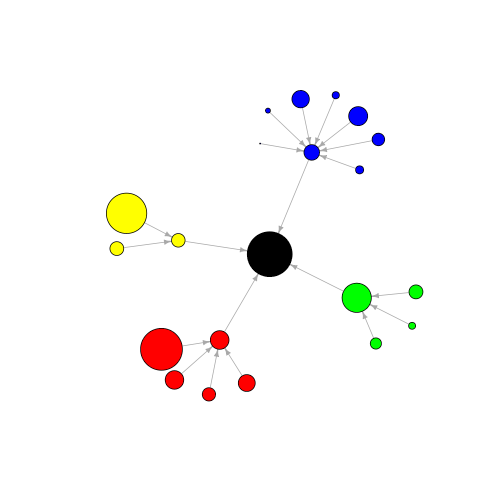
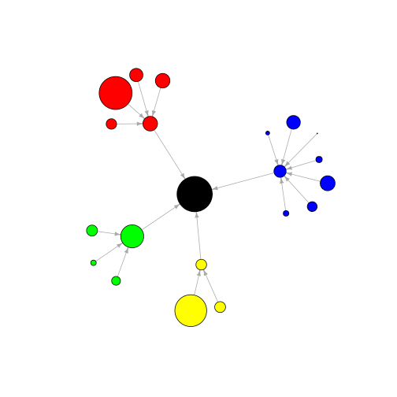
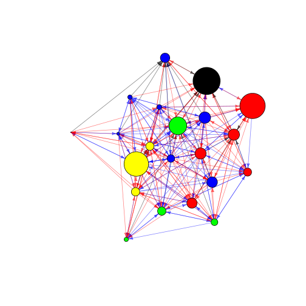
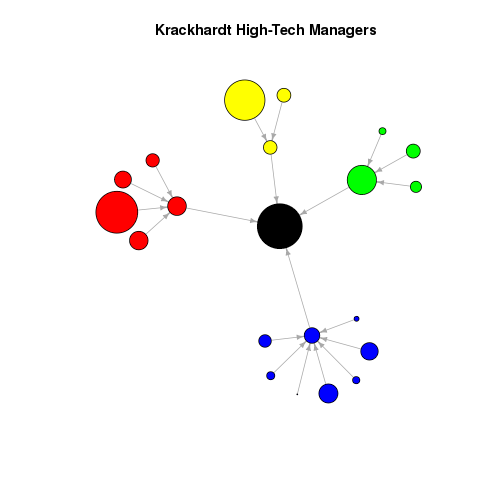

Social Network Analysis 101 (1)
========================================================
author: 許晉源 (Ed Hsu)
date: 2016.12.17 
autosize: true


本次 Workshop 重點
========================================================

涵蓋一些基本的 R 指令，載入和管理數據、圖形可視化及匯出數據以供其他地方使用。

本次教學會運用到的 R 套件為：
- igraph
- NetData (本次 workshop 主要示範及操作的數據集)


What is social network analysis ?
========================================================



<https://youtu.be/Qj2uWpYsdcM>


先來說說 Kracknets 數據集
========================================================

Kracknets 這個數據集主要是描述 Silicon Systems 這間高科技公司內員工之間的關係，當初是為了要研究哪一種人際網路會影響團體內部的輿論形成，主要包含下面這三種關係
- Attribute (員工屬性)
- Advice_tie (員工間尋求建議的關係)
- Friendship_tie (員工間友誼的關係)
- Reports_to_tie (員工間上下回報的關係)

說明文件: <https://cran.r-project.org/web/packages/NetData/NetData.pdf>


安裝、載入套件及數據集
========================================================


```r
# 安裝套件 (目前環境已安裝)
# install.packages("NetData")

# 載入 NetData 套件
library(NetData)

# 載入 kracknets 數據集
data(kracknets, package = "NetData")
```


來看看資料長什麼樣子吧 - 員工屬性
========================================================


```r
head(attributes)
```

```
  AGE TENURE LEVEL DEPT
1  33  9.333     3    4
2  42 19.583     2    4
3  40 12.750     3    2
4  33  7.500     3    4
5  32  3.333     3    2
6  59 28.000     3    1
```

```r
# tail(attributes)
```


來看看資料長什麼樣子吧 - 員工屬性
========================================================


```r
summary(attributes)
```

```
      AGE            TENURE           LEVEL            DEPT     
 Min.   :27.00   Min.   : 0.250   Min.   :1.000   Min.   :0.00  
 1st Qu.:33.00   1st Qu.: 7.500   1st Qu.:3.000   1st Qu.:1.00  
 Median :37.00   Median : 9.333   Median :3.000   Median :2.00  
 Mean   :39.71   Mean   :11.746   Mean   :2.714   Mean   :2.19  
 3rd Qu.:43.00   3rd Qu.:12.500   3rd Qu.:3.000   3rd Qu.:3.00  
 Max.   :62.00   Max.   :30.000   Max.   :3.000   Max.   :4.00  
```


來看看資料長什麼樣子吧 - 員工之間的關係
========================================================




來看看資料長什麼樣子吧 - 員工之間的關係
========================================================


```r
head(krack_full_data_frame)
```

```
  ego alter advice_tie friendship_tie reports_to_tie
1   1     1          0              0              0
2   1     2          1              1              1
3   1     3          0              0              0
4   1     4          1              1              0
5   1     5          0              0              0
6   1     6          0              0              0
```


一點簡單的資料整理
========================================================

為了簡化資料，我們利用 subset() 將一些沒有關聯的列 (edge) 去掉，只剩下有關聯的資料


```r
krack_full_nonzero_edges <- subset(krack_full_data_frame, (advice_tie > 0 | friendship_tie > 0 | reports_to_tie > 0))

head(krack_full_nonzero_edges)
```

```
   ego alter advice_tie friendship_tie reports_to_tie
2    1     2          1              1              1
4    1     4          1              1              0
8    1     8          1              1              0
12   1    12          0              1              0
16   1    16          1              1              0
18   1    18          1              0              0
```


一點簡單的資料整理
========================================================

處理前


```r
str(krack_full_data_frame)
```

```
'data.frame':	441 obs. of  5 variables:
 $ ego           : int  1 1 1 1 1 1 1 1 1 1 ...
 $ alter         : int  1 2 3 4 5 6 7 8 9 10 ...
 $ advice_tie    : int  0 1 0 1 0 0 0 1 0 0 ...
 $ friendship_tie: int  0 1 0 1 0 0 0 1 0 0 ...
 $ reports_to_tie: int  0 1 0 0 0 0 0 0 0 0 ...
```


一點簡單的資料整理
========================================================

處理後


```r
str(krack_full_nonzero_edges)
```

```
'data.frame':	232 obs. of  5 variables:
 $ ego           : int  1 1 1 1 1 1 1 2 2 2 ...
 $ alter         : int  2 4 8 12 16 18 21 1 6 7 ...
 $ advice_tie    : int  1 1 1 0 1 1 1 0 1 1 ...
 $ friendship_tie: int  1 1 1 1 1 0 0 1 0 0 ...
 $ reports_to_tie: int  1 0 0 0 0 0 0 0 0 1 ...
```


igraph 套件
========================================================

igraph 套件很適合用來分析 graph 與 network 類型的數據，內建函式包含三個方向
- Graph generating
- Visualization
- Analysis method

說明文件: <http://cran.r-project.org/web/packages/igraph/igraph.pdf>


安裝、載入套件
========================================================


```r
# 安裝套件 (目前環境已安裝)
# install.packages("igraph")
```


```r
# 載入 igraph 套件
library(igraph) 
```


來熟悉一下 igraph 套件的操作
========================================================

使用 graph.data.frame() 將已整理好的 krack_full_nonzero_edges 載入讓 igraph 可以讀取


```r
# graph.data.frame() 已預設將資料的前兩行視作端點 (Vertex)，
# 其餘行數視作為端點之間的關係 (Edges)
krack_full <- graph.data.frame(krack_full_nonzero_edges) 
```


```r
# 看一下載入的狀況
summary(krack_full)
```

```
IGRAPH DN-- 21 232 -- 
+ attr: name (v/c), advice_tie (e/n), friendship_tie (e/n),
| reports_to_tie (e/n)
```


將 Graph 物件中的各個端點 (Vertex) 加上屬性
========================================================

使用 set.vertex.attribute()


```r
attributes = cbind(1:length(attributes[,1]), attributes)
  
krack_full <- graph.data.frame(d = krack_full_nonzero_edges, vertices = attributes) 
```


```r
# 再來看一下載入的狀況，此時 graph 多了 4個 'AGE' 'TENURE' 'LEVEL' 'DEPT' 屬性
summary(krack_full)
```

```
IGRAPH DN-- 21 232 -- 
+ attr: name (v/c), AGE (v/n), TENURE (v/n), LEVEL (v/n), DEPT
| (v/n), advice_tie (e/n), friendship_tie (e/n), reports_to_tie
| (e/n)
```


使用 igraph 套件中的函式 - get.edge.attribute()
========================================================

igraph 套件中有一些很方便的函式可使用，如 get.edge.attribute() 與 get.vertex.attribute()
get.edge.attribute() 可以取出 graph 中端點與端點的關聯


```r
# 使用 get.edge.attribute() 取出員工間上下回報的關係
get.edge.attribute(krack_full, 'reports_to_tie')
```

```
  [1] 1 0 0 0 0 0 0 0 0 1 0 0 0 0 0 0 0 0 0 0 0 0 1 0 0 0 0 0 0 1 0 0 0 0 0
 [36] 0 0 0 0 0 0 0 0 0 0 0 0 0 0 1 0 0 0 0 0 0 0 0 0 0 0 1 0 0 0 0 0 0 0 0
 [71] 0 0 0 0 0 0 0 1 0 0 0 0 0 0 0 0 1 0 0 0 0 0 0 0 0 0 0 0 0 0 0 0 0 0 1
[106] 0 0 0 0 0 0 0 0 0 0 0 0 0 0 1 0 0 0 0 0 1 0 0 0 0 0 1 0 0 1 0 0 0 0 0
[141] 0 0 0 0 0 0 0 0 0 0 0 1 0 0 0 0 0 0 0 1 0 0 0 0 0 0 0 0 0 0 0 0 0 0 0
[176] 0 0 0 0 1 0 0 0 0 0 1 0 0 0 0 0 0 0 0 0 0 0 0 0 0 0 0 0 0 0 1 0 0 0 0
[211] 0 0 0 0 0 1 0 0 0 0 0 0 0 0 0 1 0 0 0 0 0 0
```

```r
# 另一種寫法
# get.edge.attribute(krack_full)$friendship_tie
```


使用 igraph 套件中的函式 - get.vertex.attribute()
========================================================

get.vertex.attribute() 則可以取出端點的屬性


```r
# 使用 get.vertex.attribute() 取出員工的任期 (TENURE) 與部門 (DEPT) 屬性
get.vertex.attribute(krack_full, 'TENURE')
```

```
 [1]  9.333 19.583 12.750  7.500  3.333 28.000 30.000 11.333  5.417  9.250
[11] 27.000  8.917  0.250 10.417  8.417  4.667 12.417  9.083  4.833 11.667
[21] 12.500
```

```r
get.vertex.attribute(krack_full, 'DEPT')
```

```
 [1] 4 4 2 4 2 1 0 1 2 3 3 1 2 2 2 4 1 3 2 2 1
```


學員可自行練習
========================================================

來吧，動手做才有收穫歐


```r
# get.edge.attribute(krack_full)
# get.vertex.attribute(krack_full)
```


參考: 將整理好 graph 的儲存於 txt 中
========================================================


```r
# 設定路徑
# setwd('~/hackntu2016/sna/lab_1/')

# 寫入
# write.graph(krack_full, file='krack_full.txt', format="edgelist")
```


若是有大量的 graph 形式的數據儲存、查詢的需求，可以參考 Neo4j 這一類的 graph database
- Neo4j: <https://neo4j.com/>
- Neo4j client R package: <https://cran.r-project.org/web/packages/RNeo4j/RNeo4j.pdf>
- Visualizing Your Graph with RNeo4j: <https://neo4j.com/blog/visualize-graph-with-rneo4j/>

 
 
將 Graph 用視覺化的方式呈現
========================================================

用 plot() 將各個端點的連接關係畫出來


```r
plot(krack_full)
```




來整理一下，只取出其中一種關係來觀察
========================================================

上一張圖包含太多的關係，因此看起來一整個混亂．
這次我們試試只取出上下回報的關係 (reports_to_tie) 來看看


```r
# 使用 delete.edges 與 == 0 去除無關聯的 edge，只留下有關聯的 edge
krack_reports_to_only <- delete.edges(krack_full, E(krack_full)[get.edge.attribute(krack_full, name = "reports_to_tie") == 0])

summary(krack_reports_to_only)
```

```
IGRAPH DN-- 21 20 -- 
+ attr: name (v/c), AGE (v/n), TENURE (v/n), LEVEL (v/n), DEPT
| (v/n), advice_tie (e/n), friendship_tie (e/n), reports_to_tie
| (e/n)
```


上下回報的關係圖
========================================================

7 號在公司內部可能是老闆的角色


```r
plot(krack_reports_to_only)
```




加上一點顏色
========================================================

根據不同部門的員工加上不同的顏色，方便觀察


```r
# Now let's color-code vertices by department and clean up the 
# plot by removing vertex labels and shrinking the arrow size. 

dept_vertex_colors = get.vertex.attribute(krack_full,"DEPT")
colors = c('Black', 'Red', 'Blue', 'Yellow', 'Green')
dept_vertex_colors[dept_vertex_colors == 0] = colors[1]
dept_vertex_colors[dept_vertex_colors == 1] = colors[2]
dept_vertex_colors[dept_vertex_colors == 2] = colors[3]
dept_vertex_colors[dept_vertex_colors == 3] = colors[4] 
dept_vertex_colors[dept_vertex_colors == 4] = colors[5]
```


========================================================


```r
plot(krack_reports_to_only, 
     vertex.color=dept_vertex_colors, 
     vertex.label=NA, 
     edge.arrow.size=.5)
```




加上各個端點的大小
========================================================

除了顏色以外，我們也可以將端點的大小賦予意義，方便觀察


```r
# Now let's set the vertex size by tenure.
tenure_vertex_sizes = get.vertex.attribute(krack_full,"TENURE")
 
plot(krack_reports_to_only, 
     vertex.color=dept_vertex_colors, 
     vertex.label=NA, 
     edge.arrow.size=.5, 
     vertex.size=tenure_vertex_sizes)
```




Plot without layout
========================================================


```r
# Now let's incorporate additional tie types. We'll use the 
# layout generated by the reports-to ties but overlay the 
# advice and friendship ties in red and blue.
 
tie_type_colors = c(rgb(1,0,0,.5), rgb(0,0,1,.5), rgb(0,0,0,.5))
E(krack_full)$color[ E(krack_full)$advice_tie==1 ] = tie_type_colors[1]
E(krack_full)$color[ E(krack_full)$friendship_tie==1 ] = tie_type_colors[2]
E(krack_full)$color[ E(krack_full)$reports_to_tie==1 ] = tie_type_colors[3]
E(krack_full)$arrow.size=.5 
V(krack_full)$color = dept_vertex_colors
V(krack_full)$frame = dept_vertex_colors
```


plot without layout
========================================================


```r
plot(krack_full, 
     vertex.color=dept_vertex_colors, 
     vertex.label=NA, 
     edge.arrow.size=.5,
     vertex.size=tenure_vertex_sizes)
```




setup layout
========================================================

Still kind of messy, so let's clean things up a bit. For 
simplicity, we'll focus on reports_to ties for now.
  
First, we can optimize the layout by applying the layout 
algorithm to the specific set of ties we care about. Here 
we'll use Fruchterman-Rheingold; other options are 
described in the igraph help page for "layout," which 
can be accessed by entering ?layout.


```r
reports_to_layout <- layout.fruchterman.reingold(krack_reports_to_only)
```


plot with layout
========================================================


```r
plot(krack_full, 
     layout=reports_to_layout, 
     vertex.color=dept_vertex_colors, 
     vertex.label=NA, 
     edge.arrow.size=.5,
     vertex.size=tenure_vertex_sizes)
```




參考: 將畫好的圖儲存於 pdf 中
========================================================


```r
# 設定儲存 pdf 的路徑
# setwd("~/path/to/where_you_want_save")

# 將圖儲存至 pdf 中
# pdf("1.1_Krackhardt_Full.pdf")
# plot(krack_full)
# dev.off()
```


參考: 將 graph 的資料以檔案的方式輸出
========================================================

  
The write.graph() function exports a graph object in various
formats readable by other programs. There is no explicit
option for a UCINET data type, but you can export the graph
as a Pajek object by setting the 'format' parameter to 'pajek.'

Note that the file will appear in whichever directory is set 
as the default in R's preferences, unless you previously 
changed this via setwd().


```r
write.graph(krack_full, file='krack_full.dl', format="pajek")
```


========================================================

For a more general file type (e.g., importable to Excel),
use the "edgelist" format. Note that neither of these will
write the attributes; only the ties are maintained.


```r
write.graph(krack_full, file='krack_full.txt', format="edgelist")
```


