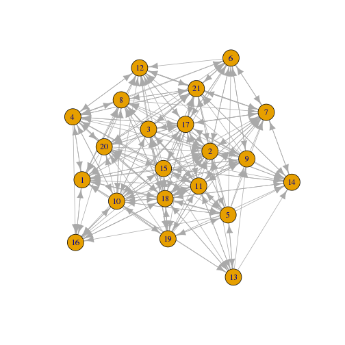
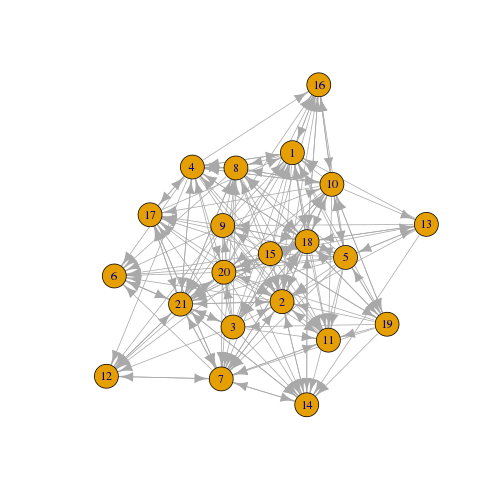
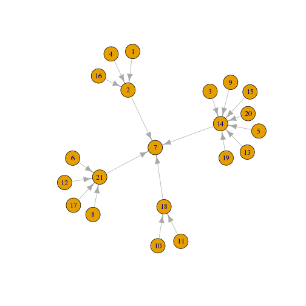
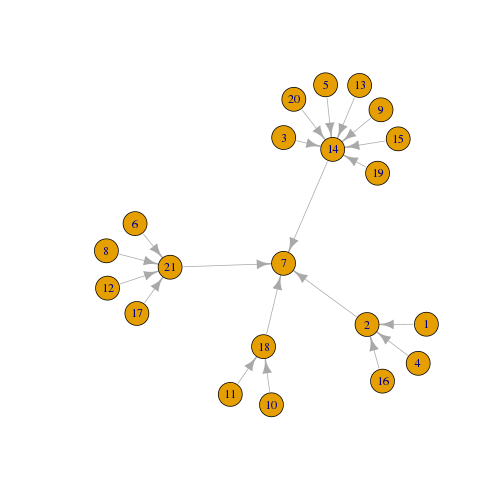
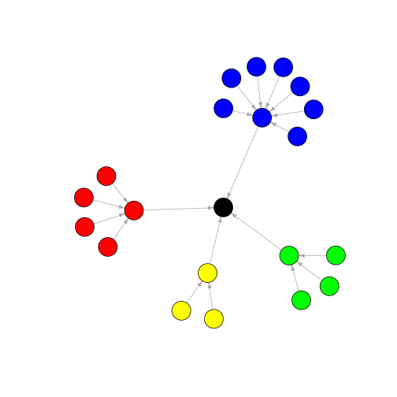
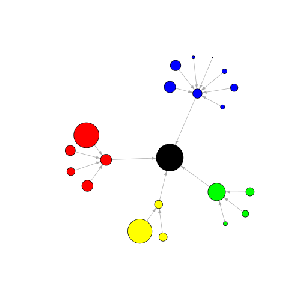
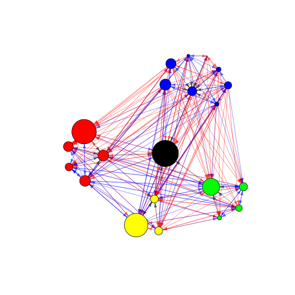
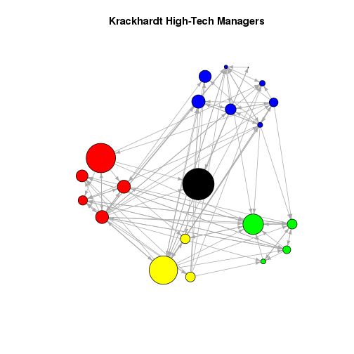

lab_1_slide
========================================================
author: 
date: 
autosize: true


First Slide
========================================================

涵蓋一些基本的R命令，加載和管理數據、圖形可視化及匯出數據以供其他地方使用。

本次教學會運用到的Ｒ套件為：
- Bullet 1
- igraph


用 read.table() 載入些資料小試牛刀吧
========================================================

read.table('path/to/file') 可以從網路或本機載入資料


```r
# 設定檔案所在路徑之檔案夾
setwd('~/hackntu2016_sna/lab_1')

advice_data_frame <- read.table('Krack-High-Tec-edgelist-Advice.txt')

friendship_data_frame <- read.table('Krack-High-Tec-edgelist-Friendship.txt')

reports_to_data_frame <- read.table('https://goo.gl/W1YP8P')
```


可以用 head()、tail() 觀察載入的資料
========================================================


```r
# 確認資料的型態
typeof(advice_data_frame)
```

```
[1] "list"
```

```r
class(advice_data_frame)
```

```
[1] "data.frame"
```


```r
# head()、tail() 顧名思義
head(advice_data_frame)
```

```
  V1 V2 V3
1  1  1  0
2  1  2  1
3  1  3  0
4  1  4  1
5  1  5  0
6  1  6  0
```


當然用 read.csv() 也 OK
========================================================

read.csv() 也跟 read.table() 很像，可以從網路或本機載入資料


```r
# 設定檔案所在路徑之檔案夾
setwd('~/hackntu2016_sna/lab_1')

attributes <- read.csv('Krack-High-Tec-Attributes.csv', header=T)

head(attributes)
```

```
  AGE TENURE LEVEL DEPT
1  33  9.333     3    4
2  42 19.583     2    4
3  40 12.750     3    2
4  33  7.500     3    4
5  32  3.333     3    2
6  59 28.000     3    1
```


針對連續的資料集可以用 summary() 
========================================================

針對連續的資料型態，可以用 summary() 可以很快地看出資料的分佈狀況


```r
summary(attributes)
```

```
      AGE            TENURE           LEVEL            DEPT     
 Min.   :27.00   Min.   : 0.250   Min.   :1.000   Min.   :0.00  
 1st Qu.:33.00   1st Qu.: 7.500   1st Qu.:3.000   1st Qu.:1.00  
 Median :37.00   Median : 9.333   Median :3.000   Median :2.00  
 Mean   :39.71   Mean   :11.746   Mean   :2.714   Mean   :2.19  
 3rd Qu.:43.00   3rd Qu.:12.500   3rd Qu.:3.000   3rd Qu.:3.00  
 Max.   :62.00   Max.   :30.000   Max.   :3.000   Max.   :4.00  
```


用 colnames() 標示各行的名稱
========================================================

為了方便，我們可以用 colnames() 標示各行的名稱


```r
# c() is a common generic R function that combines its arguments into a single vector.

colnames(advice_data_frame) <- c('ego', 'alter', 'advice_tie')
head(advice_data_frame)
```

```
  ego alter advice_tie
1   1     1          0
2   1     2          1
3   1     3          0
4   1     4          1
5   1     5          0
6   1     6          0
```


用 colnames() 標示各行的名稱
========================================================

同上一張投影片，我們也將 friendship_data_frame、reports_to_data_frame 標示各行的名稱


```r
colnames(friendship_data_frame) <- c('ego', 'alter', 'friendship_tie')
head(friendship_data_frame)
```

```
  ego alter friendship_tie
1   1     1              0
2   1     2              1
3   1     3              0
4   1     4              1
5   1     5              0
6   1     6              0
```


```r
colnames(reports_to_data_frame) <- c('ego', 'alter', 'reports_to_tie')
head(reports_to_data_frame)
```

```
  ego alter reports_to_tie
1   1     1              0
2   1     2              1
3   1     3              0
4   1     4              0
5   1     5              0
6   1     6              0
```


將三個 dataframe 合併為一
========================================================

方便後續處理


```r
# Now that we've verified they are all the same, we can combine them into a single data frame. 
krack_full_data_frame <- cbind(
  advice_data_frame, 
  friendship_data_frame$friendship_tie, 
  reports_to_data_frame$reports_to_tie
)
```


========================================================

更改一下 columns 的名稱避免混淆


```r
names(krack_full_data_frame)[4:5] <- c("friendship_tie", "reports_to_tie")  

head(krack_full_data_frame)
```

```
  ego alter advice_tie friendship_tie reports_to_tie
1   1     1          0              0              0
2   1     2          1              1              1
3   1     3          0              0              0
4   1     4          1              1              0
5   1     5          0              0              0
6   1     6          0              0              0
```


一點簡單的資料清洗
========================================================

為簡化表格，我們利用 subset() 將沒有關聯的列 (edge) 去掉


```r
krack_full_nonzero_edges <- subset(
  krack_full_data_frame, 
  (advice_tie > 0 | friendship_tie > 0 | reports_to_tie > 0)
)

head(krack_full_nonzero_edges)
```

```
   ego alter advice_tie friendship_tie reports_to_tie
2    1     2          1              1              1
4    1     4          1              1              0
8    1     8          1              1              0
12   1    12          0              1              0
16   1    16          1              1              0
18   1    18          1              0              0
```


igraph 套件
========================================================

igraph 套件很適合用來分析 graph 與 network 類型的數據，內建函式包含三個方向
- graph generating
- visualization
- analysis method

說明文件: <http://cran.r-project.org/web/packages/igraph/igraph.pdf>


```r
# 使用 console 安裝 igraph 
# install.packages("igraph")
```


```r
# 載入 igraph 套件
library(igraph) 
```


來熟悉一下 igraph 套件的操作
========================================================


```r
# graph.data.frame() 將已整理好的 krack_full_nonzero_edges 載入讓 igraph 可以讀取
krack_full <- graph.data.frame(krack_full_nonzero_edges) 

# 看一下載入的狀況 
summary(krack_full)
```

```
IGRAPH DN-- 21 232 -- 
+ attr: name (v/c), advice_tie (e/n), friendship_tie (e/n),
| reports_to_tie (e/n)
```


========================================================


```r
# By default, graph.data.frame() treats the first two columns of 
# a data frame as an edge list and any remaining columns as 
# edge attributes. Thus, the 232 edges appearing in the summary()
# output refer to the 232 pairs of vertices that are joined by 
# *any type* of tie. The tie types themselves are listed as edge 
# attributes.
  
# To get a vector of edges for a specific type of tie, use the 
# get.edge.attribute() function.
get.edge.attribute(krack_full, 'advice_tie')
```

```
  [1] 1 1 1 0 1 1 1 0 1 1 0 1 1 1 1 1 1 1 1 1 1 1 1 1 1 0 1 1 1 1 1 1 1 1 1
 [36] 1 1 1 1 1 1 1 1 1 1 0 1 1 1 1 1 1 1 1 1 1 0 0 0 0 0 1 1 1 1 1 1 1 1 1
 [71] 1 1 1 1 1 1 1 1 1 1 1 1 1 1 1 1 1 1 1 1 1 1 1 1 1 1 1 0 1 0 1 1 1 1 1
[106] 1 1 1 1 0 0 0 1 0 0 0 0 0 0 0 0 0 0 1 0 1 1 1 1 1 0 1 1 1 1 0 1 1 1 1
[141] 1 1 1 1 1 1 1 1 1 1 1 1 1 1 1 1 1 1 1 1 1 1 1 1 0 1 0 0 1 0 0 0 0 0 0
[176] 0 0 0 0 1 1 1 1 1 1 1 1 1 1 1 1 1 1 1 1 1 1 1 1 1 1 1 1 1 0 1 1 1 1 1
[211] 1 1 1 1 1 1 1 1 1 1 1 1 1 1 1 1 1 1 1 1 1 1
```

```r
get.edge.attribute(krack_full, 'friendship_tie')
```

```
  [1] 1 1 1 1 1 0 0 1 0 0 1 1 0 0 0 0 0 0 0 0 0 0 1 0 0 1 0 0 1 1 0 1 0 0 1
 [36] 1 1 0 0 0 0 1 0 0 0 1 0 1 0 1 0 1 0 1 0 1 1 1 1 1 1 1 0 0 0 0 0 0 0 0
 [71] 0 1 0 0 0 0 0 0 0 0 0 0 0 0 0 0 0 0 0 0 0 0 0 1 0 1 1 1 0 1 0 0 1 0 0
[106] 0 1 1 1 1 1 1 0 1 1 1 1 1 1 1 1 1 1 0 1 1 0 0 1 0 1 0 0 0 1 1 0 0 1 0
[141] 1 0 1 1 0 0 1 0 1 0 0 1 0 0 0 1 0 0 1 1 0 0 1 1 1 1 1 1 1 1 1 1 1 1 1
[176] 1 1 1 1 1 0 1 0 0 0 0 0 0 0 0 0 0 0 0 0 0 0 1 1 1 1 0 0 1 1 1 1 0 1 0
[211] 0 0 0 1 0 0 0 0 0 1 0 1 0 0 0 0 0 1 0 1 1 0
```

```r
get.edge.attribute(krack_full, 'reports_to_tie')
```

```
  [1] 1 0 0 0 0 0 0 0 0 1 0 0 0 0 0 0 0 0 0 0 0 0 1 0 0 0 0 0 0 1 0 0 0 0 0
 [36] 0 0 0 0 0 0 0 0 0 0 0 0 0 0 1 0 0 0 0 0 0 0 0 0 0 0 1 0 0 0 0 0 0 0 0
 [71] 0 0 0 0 0 0 0 1 0 0 0 0 0 0 0 0 1 0 0 0 0 0 0 0 0 0 0 0 0 0 0 0 0 0 1
[106] 0 0 0 0 0 0 0 0 0 0 0 0 0 0 1 0 0 0 0 0 1 0 0 0 0 0 1 0 0 1 0 0 0 0 0
[141] 0 0 0 0 0 0 0 0 0 0 0 1 0 0 0 0 0 0 0 1 0 0 0 0 0 0 0 0 0 0 0 0 0 0 0
[176] 0 0 0 0 1 0 0 0 0 0 1 0 0 0 0 0 0 0 0 0 0 0 0 0 0 0 0 0 0 0 1 0 0 0 0
[211] 0 0 0 0 0 1 0 0 0 0 0 0 0 0 0 1 0 0 0 0 0 0
```


========================================================


```r
# If you would like to symmetrize(對稱) the network, making all 
# asymmetric ties symmetric, use the as.undirected()
# function: 
krack_full_symmetrized <- as.undirected(krack_full, mode='collapse')

summary(krack_full_symmetrized)
```

```
IGRAPH UN-- 21 159 -- 
+ attr: name (v/c)
```


ADDING VERTEX (頂點) ATTRIBUTES TO A GRAPH OBJECT
========================================================

One way to add the attributes to your graph object is to iterate
through each attribute and each vertex. This means that we will
add one attribute at a time to each vertex in the network.

V(krack_full) returns a list of the IDs of each vertex in the 
graph. names(attributes) returns a list of the column names in
the attributes table. The double-for loop tells R to repeat the
code between the brackets once for each attribute and once for
each vertex.


```r
for (i in V(krack_full)) {
    for (j in names(attributes)) {
        krack_full <- set.vertex.attribute(krack_full, 
                                           j, 
                                           index = i, 
                                           attributes[i + 1, j])
    }
}
```


```r
V(krack_full)
```

```
+ 21/21 vertices, named:
 [1] 1  2  3  4  5  6  7  8  9  10 11 12 13 14 15 16 17 18 19 20 21
```

========================================================
  
A shorter way is to just read in attribute names when you
create the graph object:
  
First create a vector of vertex labels, in this case 1:n


```r
attributes = cbind(1:length(attributes[,1]), attributes)
  
krack_full <- graph.data.frame(d = krack_full_nonzero_edges, 
                               vertices = attributes) 
```


```r
# Note that we now have 'AGE,' 'TENURE,' 'LEVEL,' and 'DEPT'
# listed alongside 'name' as vertex attributes.
summary(krack_full)
```

```
IGRAPH DN-- 21 232 -- 
+ attr: name (v/c), AGE (v/n), TENURE (v/n), LEVEL (v/n), DEPT
| (v/n), advice_tie (e/n), friendship_tie (e/n), reports_to_tie
| (e/n)
```


========================================================


```r
# We can see a list of the values for a given attribute for all of
# the actors in the network.
get.vertex.attribute(krack_full, 'AGE')
```

```
 [1] 33 42 40 33 32 59 55 34 62 37 46 34 48 43 40 27 30 33 32 38 36
```

```r
get.vertex.attribute(krack_full, 'TENURE')
```

```
 [1]  9.333 19.583 12.750  7.500  3.333 28.000 30.000 11.333  5.417  9.250
[11] 27.000  8.917  0.250 10.417  8.417  4.667 12.417  9.083  4.833 11.667
[21] 12.500
```

```r
get.vertex.attribute(krack_full, 'LEVEL')
```

```
 [1] 3 2 3 3 3 3 1 3 3 3 3 3 3 2 3 3 3 2 3 3 2
```

```r
get.vertex.attribute(krack_full, 'DEPT')
```

```
 [1] 4 4 2 4 2 1 0 1 2 3 3 1 2 2 2 4 1 3 2 2 1
```
  

 
用 plot() 將各個節點的連接關係畫出來
========================================================

let's visualize the network with all possible ties with plot()


```r
plot(krack_full)
```



看起來一整個混亂，所以讓我們看看單邊類型(single edge types)的網絡。


參考: 將畫好的圖儲存於 pdf 中
========================================================


```r
# 設定儲存 pdf 的路徑
# setwd("~/path/to/where_you_want_save")

# 將圖儲存至 pdf 中
# pdf("1.1_Krackhardt_Full.pdf")
# plot(krack_full)
# dev.off()
```


advice only
========================================================

處理一下


```r
krack_advice_only <- delete.edges(
  krack_full, 
  E(krack_full)[get.edge.attribute(krack_full, name = "advice_tie") == 0]
)
summary(krack_advice_only)
```

```
IGRAPH DN-- 21 190 -- 
+ attr: name (v/c), AGE (v/n), TENURE (v/n), LEVEL (v/n), DEPT
| (v/n), advice_tie (e/n), friendship_tie (e/n), reports_to_tie
| (e/n)
```


========================================================


```r
plot(krack_advice_only)
```




friendship only
========================================================


```r
# 
krack_friendship_only <- delete.edges(
  krack_full, 
  E(krack_full)[get.edge.attribute(krack_full, name = "friendship_tie") == 0]
)
summary(krack_friendship_only)
```

```
IGRAPH DN-- 21 102 -- 
+ attr: name (v/c), AGE (v/n), TENURE (v/n), LEVEL (v/n), DEPT
| (v/n), advice_tie (e/n), friendship_tie (e/n), reports_to_tie
| (e/n)
```


friendship only
========================================================


```r
plot(krack_friendship_only)
```


reports-to only
========================================================


```r
krack_reports_to_only <- delete.edges(
  krack_full, 
  E(krack_full)[get.edge.attribute(krack_full, name = "reports_to_tie") == 0]
)
summary(krack_reports_to_only)
```

```
IGRAPH DN-- 21 20 -- 
+ attr: name (v/c), AGE (v/n), TENURE (v/n), LEVEL (v/n), DEPT
| (v/n), advice_tie (e/n), friendship_tie (e/n), reports_to_tie
| (e/n)
```


reports-to only
========================================================


```r
plot(krack_reports_to_only)
```




========================================================

Still kind of messy, so let's clean things up a bit. For 
simplicity, we'll focus on reports_to ties for now.
  
First, we can optimize the layout by applying the layout 
algorithm to the specific set of ties we care about. Here 
we'll use Fruchterman-Rheingold; other options are 
described in the igraph help page for "layout," which 
can be accessed by entering ?layout.


```r
reports_to_layout <- layout.fruchterman.reingold(krack_reports_to_only)

plot(krack_reports_to_only, layout=reports_to_layout)
```




========================================================


```r
# Now let's color-code vertices by department and clean up the 
# plot by removing vertex labels and shrinking the arrow size. 

dept_vertex_colors = get.vertex.attribute(krack_full,"DEPT")
colors = c('Black', 'Red', 'Blue', 'Yellow', 'Green')
dept_vertex_colors[dept_vertex_colors == 0] = colors[1]
dept_vertex_colors[dept_vertex_colors == 1] = colors[2]
dept_vertex_colors[dept_vertex_colors == 2] = colors[3]
dept_vertex_colors[dept_vertex_colors == 3] = colors[4] 
dept_vertex_colors[dept_vertex_colors == 4] = colors[5]
```


========================================================


```r
plot(
  krack_reports_to_only, 
  layout=reports_to_layout, 
  vertex.color=dept_vertex_colors, 
  vertex.label=NA, 
  edge.arrow.size=.5
)
```




========================================================


```r
# Now let's set the vertex size by tenure.
tenure_vertex_sizes = get.vertex.attribute(krack_full,"TENURE")
 
plot(krack_reports_to_only, 
     layout=reports_to_layout, 
     vertex.color=dept_vertex_colors, 
     vertex.label=NA, 
     edge.arrow.size=.5,
     vertex.size=tenure_vertex_sizes)
```




========================================================


```r
# Now let's incorporate additional tie types. We'll use the 
# layout generated by the reports-to ties but overlay the 
# advice and friendship ties in red and blue.
 
tie_type_colors = c(rgb(1,0,0,.5), rgb(0,0,1,.5), rgb(0,0,0,.5))
E(krack_full)$color[ E(krack_full)$advice_tie==1 ] = tie_type_colors[1]
E(krack_full)$color[ E(krack_full)$friendship_tie==1 ] = tie_type_colors[2]
E(krack_full)$color[ E(krack_full)$reports_to_tie==1 ] = tie_type_colors[3]
E(krack_full)$arrow.size=.5 
V(krack_full)$color = dept_vertex_colors
V(krack_full)$frame = dept_vertex_colors
```


....
========================================================


```r
plot(krack_full, 
     layout=reports_to_layout, 
     vertex.color=dept_vertex_colors, 
     vertex.label=NA, 
     edge.arrow.size=.5,
     vertex.size=tenure_vertex_sizes)
```




========================================================
Another option for visualizing different network ties relative 
to one another is to overlay the edges from one tie type on the 
structure generated by another tie type. Here we can use the
reports-to layout but show the friendship ties:


```r
plot(
  krack_friendship_only, 
  layout=reports_to_layout, 
  vertex.color=dept_vertex_colors, 
  vertex.label=NA, 
  edge.arrow.size=.5,
  vertex.size=tenure_vertex_sizes, 
  main='Krackhardt High-Tech Managers'
)
```


  
  

將 graph 的資料輸出
========================================================

  
The write.graph() function exports a graph object in various
formats readable by other programs. There is no explicit
option for a UCINET data type, but you can export the graph
as a Pajek object by setting the 'format' parameter to 'pajek.'

Note that the file will appear in whichever directory is set 
as the default in R's preferences, unless you previously 
changed this via setwd().


```r
write.graph(krack_full, file='krack_full.dl', format="pajek")
```


========================================================

For a more general file type (e.g., importable to Excel),
use the "edgelist" format. Note that neither of these will
write the attributes; only the ties are maintained.


```r
write.graph(krack_full, file='krack_full.txt', format="edgelist")
```


```
Error in eval(expr, envir, enclos) : object 'get.graph.' not found
```
