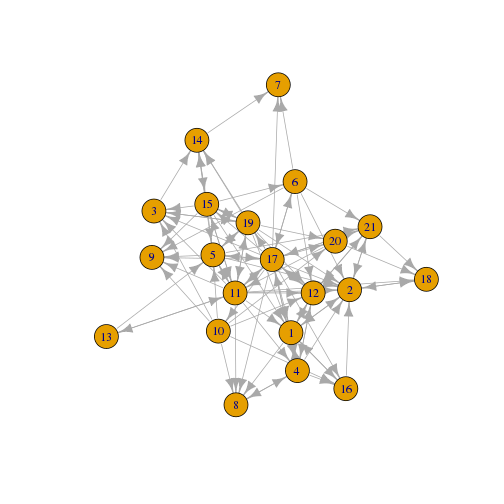
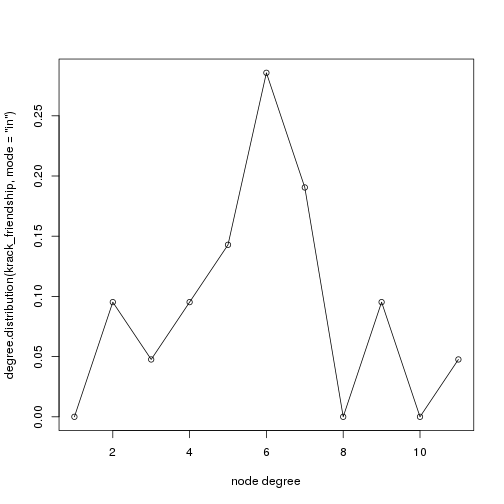
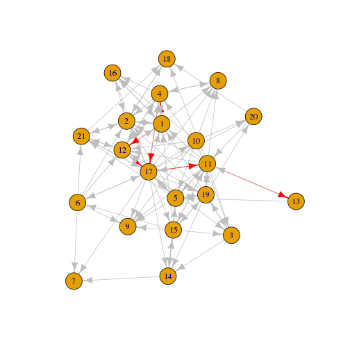
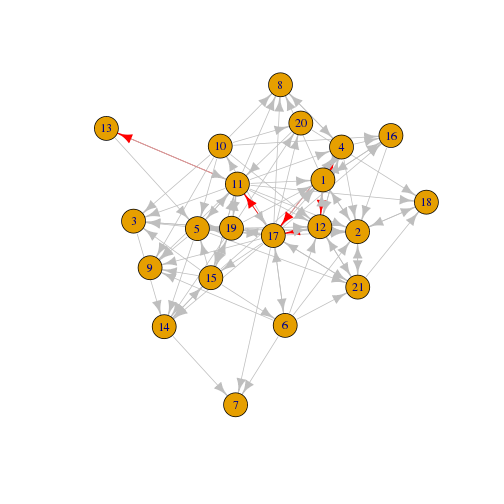
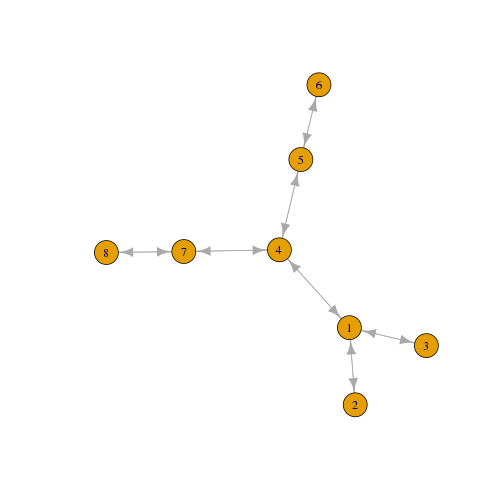
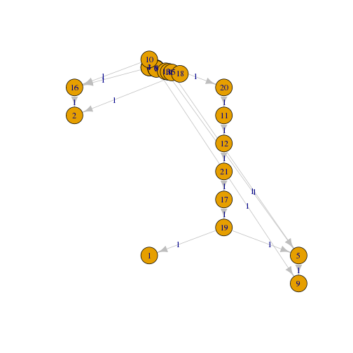
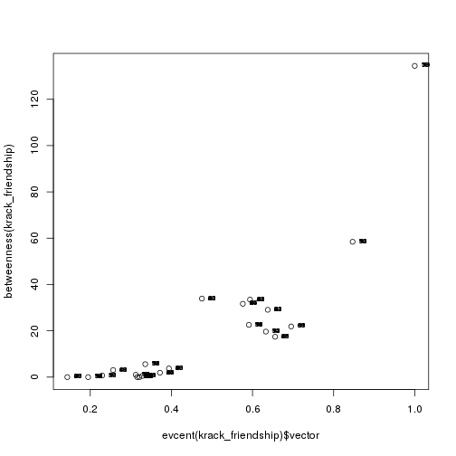

Social Network Analysis 101 (2)
========================================================
author: 許晉源 (Ed Hsu)
date: 2016.12.17 
autosize: true

First Slide
========================================================

For more details on authoring R presentations please visit <https://support.rstudio.com/hc/en-us/articles/200486468>.

- Bullet 1
- Bullet 2
- Bullet 3


========================================================

LAB 2: Methodological beginnings - Density, Reciprocity, Triads, 
Transitivity, and heterogeneity. Node and network statistics.


========================================================
Lab 2 

The purpose of this lab is to acquire basic cohesion metrics of density, reciprocity, reach, path distance, and transitivity. In addition, we'll develop triadic analyses and a measure of ego-network heterogenity. 

本實驗的目的是獲得密度，互易性，到達，路徑距離和傳遞性的基本內聚度量。 此外，我們將開發三元分析和自我 - 網絡異質性的度量。


資料取得 (Data Collection)
========================================================

由於人際網路的資料可能相當龐大及複雜，為了可以快速取得相關的資料及數據進行分析，我們可以根據問題選定目標族群，採用滾雪球取樣 (Snowball Sampling)

滾雪球取樣法是一種 "非隨機式抽樣" 的方法，透過人際關係網路，類似滾雪球般從一個人 (端點) 找到下一個人 (端點) ，逐漸累積到足夠的調查樣本為止稱之，這種抽樣方式常用於社會學研究

滾雪球抽樣法的優點在於可快速收集到少數人際關係樣本，此方法使用得當不但費用少且簡單有效，但滾雪球抽樣法的缺點也是 "非隨機式抽樣"，在某特定的人際網路中，抽取的樣本可能具有極高的同質性

<http://terms.naer.edu.tw/detail/1678729/>


滾雪球取樣 (Snowball Sampling)
========================================================

通常在進行 Snowball Sampling 時，我們會先選定位於人際關係網路中重要的點，再以此去擴散抽樣的範圍．並不會無限制的一直抽樣下去，大概會限縮於三層的關係 (朋友、朋友的朋友、朋友的朋友的朋友)

影片: <https://www.youtube.com/watch?v=BIEteh4nryM>


Node-Level Statistics
========================================================

根據前面 Snowball Sampling 的描述，我們該如何找尋重要的點呢?

重要的點包含四種:
- 人際網路的明星
- 人際網路最有效的訊息傳遞者
- 人際網路中不同群體的樞紐
- 人際網路中幕後決策的藏鏡人


用 krack_friendship 來操作看看吧
========================================================

接下來我們聚焦在 friendship 這個網路，透過一些指標找尋這些重要的點





度數 (Degree)
========================================================

度數 (degree) 指的是某端點 (vertex) 與其他端點的連接線的數目，其中又因連接線的方向分為兩種
- in-degree : 連入的數目
- out-defree : 連出的數目

以 friendship 來說，代表友誼的關係並不是雙向的 (天啊~好像有點殘忍~囧)


來思考一下 in-degree 的意義
========================================================

套用前面的 krack_friendship 觀察看看，in-degree 越高，代表很多人都把你加入好友名單，表示人氣越旺


```r
# 2 號員工是公司內最受歡迎的人，大概是公司裡的好好先生
deg_friendship_in <- degree(krack_friendship, mode="in") 
deg_friendship_in
```

```
 1  2  3  4  5  6  7  8  9 10 11 12 13 14 15 16 17 18 19 20 21 
 8 10  5  5  6  2  3  5  6  1  6  8  1  5  4  4  6  4  5  3  5 
```


配合一些簡單的統計
========================================================


```r
# 可以用 summary() 很快地看出資料的分佈狀況
summary(deg_friendship_in)
```

```
   Min. 1st Qu.  Median    Mean 3rd Qu.    Max. 
  1.000   4.000   5.000   4.857   6.000  10.000 
```

```r
# mean() 計算平均值
mean(deg_friendship_in)
```

```
[1] 4.857143
```

```r
# sd() 計算標準差
sd(deg_friendship_in)
```

```
[1] 2.220039
```


畫出 degree_in 的分佈 (1)
========================================================


```r
# 搭配使用 R 本身與 igraph 套件中的函式
degree.distribution(krack_friendship, mode="in")
```

```
 [1] 0.00000000 0.09523810 0.04761905 0.09523810 0.14285714 0.28571429
 [7] 0.19047619 0.00000000 0.09523810 0.00000000 0.04761905
```


畫出 degree_in 的分佈 (2)
========================================================


```r
plot(degree.distribution(krack_friendship, mode="in"), xlab="node degree")
lines(degree.distribution(krack_friendship, mode="in"))
```




來思考一下 out-degree 的意義
========================================================

套用前面的 krack_friendship 觀察看看，out-degree 越高，表示好友名單越長，認識的人越多


```r
# 17 號員工認識最多人，大概是人資主管一類的
deg_friendship_out <- degree(krack_friendship, mode="out") 
deg_friendship_out
```

```
 1  2  3  4  5  6  7  8  9 10 11 12 13 14 15 16 17 18 19 20 21 
 5  3  2  6  7  6  0  1  0  7 13  4  2  2  8  2 18  1  9  2  4 
```


配合一些簡單的統計
========================================================


```r
# 可以用 summary() 很快地看出資料的分佈狀況
summary(deg_friendship_out)
```

```
   Min. 1st Qu.  Median    Mean 3rd Qu.    Max. 
  0.000   2.000   4.000   4.857   7.000  18.000 
```

```r
# mean() 計算平均值
mean(deg_friendship_out)
```

```
[1] 4.857143
```

```r
# sd() 計算標準差
sd(deg_friendship_out)
```

```
[1] 4.475329
```


畫出 degree_out 的分佈 (1)
========================================================


```r
degree.distribution(krack_friendship, mode="out")
```

```
 [1] 0.09523810 0.09523810 0.23809524 0.04761905 0.09523810 0.04761905
 [7] 0.09523810 0.09523810 0.04761905 0.04761905 0.00000000 0.00000000
[13] 0.00000000 0.04761905 0.00000000 0.00000000 0.00000000 0.00000000
[19] 0.04761905
```


畫出 degree_out 的分佈 (2)
========================================================


```r
plot(degree.distribution(krack_friendship, mode="out"), xlab="node degree")

lines(degree.distribution(krack_friendship, mode="out"))
```


可達性 (Reachability)
========================================================

任意兩個端點間可以存在不同路徑，任意兩端點間若存在一路徑，則具有可達關係 (Reachable)
兩點若不相通，則無傳遞的路徑存在

跟 Degree 一樣，因連接線的方向分為兩種
- Reachability-In: 連入的可達性
- Reachability-Out: 連出的可達性


來思考一下 Reachability 的意義 (1)
========================================================

套用前面的 krack_friendship 觀察看看，確認端點與端點間的網路是否連通
以人際網路來說，就是誰認識誰，又可以透過誰去認識誰


```r
# 可使用 subcomponent()，確認端點與端點之間的連接性
# 這 19 個員工與 17 號員工有直接跟間接地認識關係
reach_friendship_in <- subcomponent(krack_friendship, 17, mode="in")
reach_friendship_in
```

```
+ 19/21 vertices, named:
 [1] 17 4  5  6  11 12 21 1  8  10 13 15 19 20 2  16 14 3  18
```


來思考一下 Reachability 的意義 (2)
========================================================

由 Reachability-Out 的結果來看，由 17 號員工所輻射出去的人際網路可以涵蓋公司的所有員工


```r
reach_friendship_out <- subcomponent(krack_friendship, 17, mode="out")
reach_friendship_out
```

```
+ 21/21 vertices, named:
 [1] 17 1  2  3  4  5  6  7  8  9  10 11 12 14 15 16 19 20 21 18 13
```


最短路徑 (Shortest Paths) 
========================================================

通常我們想了解網絡中端點之間的路徑距離，除了透過可達性 (Reachability)，確認端點與端點間是否有相連的關係外．可以進一步透過最短路徑 (Shortest Paths) 了解 端點與端點間相連的關係

備註: 最短路徑 (Shortest Paths) 又稱測地線距離 (Geodesic Distance) 或簡稱距離 (Distance)，一樣都是指兩端點之間最短路徑的長度


來思考一下 Shortest Paths 的意義 (1)
========================================================

套用前面的 krack_friendship 觀察看看，簡單來說 Shortest Paths 就是計算誰與誰差了幾層朋友的關係


```r
# Compute shortest paths between each pair of nodes.
sp_friendship_in <- shortest.paths(krack_friendship, mode='in')
sp_friendship_in
```

```
   1 2 3 4 5 6   7 8   9 10 11 12 13 14 15 16 17 18 19 20 21
1  0 1 2 1 2 2 Inf 2 Inf  2  1  1  2  2  1  1  1  2  1  2  2
2  1 0 2 1 1 1 Inf 2 Inf  2  1  2  2  3  2  1  1  1  1  2  1
3  3 3 0 2 2 2 Inf 3 Inf  1  1  2  2  2  1  4  1  4  1  2  2
4  1 2 3 0 2 2 Inf 1 Inf  2  1  1  2  3  2  2  1  3  2  2  2
5  3 3 2 2 0 2 Inf 3 Inf  1  1  2  1  2  1  4  1  4  1  2  2
6  3 3 3 2 2 0 Inf 3 Inf  3  2  2  3  2  1  4  1  4  2  3  2
7  3 3 2 2 2 1   0 3 Inf  3  2  2  3  1  2  4  1  4  2  3  2
8  1 2 3 1 2 2 Inf 0 Inf  1  1  2  2  3  2  2  1  3  2  2  2
9  3 3 3 2 1 1 Inf 3   0  1  1  2  2  2  1  4  1  4  2  2  2
10 3 3 4 2 2 2 Inf 3 Inf  0  2  2  3  4  3  4  1  4  3  3  2
11 3 3 2 2 1 2 Inf 3 Inf  2  0  2  1  2  1  4  1  4  1  1  2
12 1 2 2 1 2 1 Inf 2 Inf  1  1  0  2  3  2  2  1  3  1  2  1
13 4 4 3 3 2 3 Inf 4 Inf  3  1  3  0  3  2  5  2  5  2  2  3
14 3 3 1 2 1 2 Inf 3 Inf  2  2  2  2  0  1  4  1  4  1  3  2
15 3 3 2 2 2 2 Inf 3 Inf  3  1  2  2  1  0  4  1  4  1  2  2
16 1 2 3 1 2 2 Inf 2 Inf  1  2  2  3  3  2  0  1  3  2  3  2
17 2 2 3 1 1 1 Inf 2 Inf  2  1  1  2  3  2  3  0  3  2  2  1
18 2 1 3 2 2 2 Inf 3 Inf  2  1  2  2  3  2  2  2  0  2  1  1
19 3 3 1 2 1 2 Inf 3 Inf  2  1  2  2  2  1  4  1  4  0  2  2
20 3 3 2 2 2 2 Inf 3 Inf  1  2  2  3  3  2  4  1  4  1  0  2
21 2 1 3 2 1 1 Inf 3 Inf  2  2  1  2  3  2  2  1  2  2  3  0
```


來思考一下 shortest paths 的意義 (2)
========================================================

套用前面的 krack_friendship 觀察看看，簡單來說 Shortest Paths 就是計算誰與誰差了幾層朋友的關係


```r
# Inf 表示沒有聯通的最短路徑，可以對照 deg_friendship_out
sp_friendship_out <- shortest.paths(krack_friendship, mode='out')
sp_friendship_out
```

```
     1   2   3   4   5   6   7   8   9  10  11  12  13  14  15  16  17  18
1    0   1   3   1   3   3   3   1   3   3   3   1   4   3   3   1   2   2
2    1   0   3   2   3   3   3   2   3   3   3   2   4   3   3   2   2   1
3    2   2   0   3   2   3   2   3   3   4   2   2   3   1   2   3   3   3
4    1   1   2   0   2   2   2   1   2   2   2   1   3   2   2   1   1   2
5    2   1   2   2   0   2   2   2   1   2   1   2   2   1   2   2   1   2
6    2   1   2   2   2   0   1   2   1   2   2   1   3   2   2   2   1   2
7  Inf Inf Inf Inf Inf Inf   0 Inf Inf Inf Inf Inf Inf Inf Inf Inf Inf Inf
8    2   2   3   1   3   3   3   0   3   3   3   2   4   3   3   2   2   3
9  Inf Inf Inf Inf Inf Inf Inf Inf   0 Inf Inf Inf Inf Inf Inf Inf Inf Inf
10   2   2   1   2   1   3   3   1   1   0   2   1   3   2   3   1   2   2
11   1   1   1   1   1   2   2   1   1   2   0   1   1   2   1   2   1   1
12   1   2   2   1   2   2   2   2   2   2   2   0   3   2   2   2   1   2
13   2   2   2   2   1   3   3   2   2   3   1   2   0   2   2   3   2   2
14   2   3   2   3   2   2   1   3   2   4   2   3   3   0   1   3   3   3
15   1   2   1   2   1   1   2   2   1   3   1   2   2   1   0   2   2   2
16   1   1   4   2   4   4   4   2   4   4   4   2   5   4   4   0   3   2
17   1   1   1   1   1   1   1   1   1   1   1   1   2   1   1   1   0   2
18   2   1   4   3   4   4   4   3   4   4   4   3   5   4   4   3   3   0
19   1   1   1   2   1   2   2   2   2   3   1   1   2   1   1   2   2   2
20   2   2   2   2   2   3   3   2   2   3   1   2   2   3   2   3   2   1
21   2   1   2   2   2   2   2   2   2   2   2   1   3   2   2   2   1   1
    19  20  21
1    3   3   2
2    3   3   1
3    1   2   3
4    2   2   2
5    1   2   1
6    2   2   1
7  Inf Inf Inf
8    3   3   3
9  Inf Inf Inf
10   2   1   2
11   1   2   2
12   2   2   1
13   2   3   2
14   2   3   3
15   1   2   2
16   4   4   2
17   1   1   1
18   4   4   2
19   0   1   2
20   2   0   3
21   2   2   0
```


配合一些簡單的統計
========================================================


```r
mean(sp_friendship_in[which(sp_friendship_in != Inf)])
```

```
[1] 1.992519
```

```r
sd(sp_friendship_in[which(sp_friendship_in != Inf)])
```

```
[1] 0.9911831
```

```r
mean(sp_friendship_out[which(sp_friendship_out != Inf)])
```

```
[1] 1.992519
```

```r
sd(sp_friendship_out[which(sp_friendship_out != Inf)])
```

```
[1] 0.9911831
```

========================================================


```r
shortest.paths(krack_friendship)
```

```
   1 2 3 4 5 6 7 8 9 10 11 12 13 14 15 16 17 18 19 20 21
1  0 1 2 1 2 2 2 1 2  2  1  1  2  2  1  1  1  2  1  2  2
2  1 0 2 1 1 1 2 2 2  2  1  2  2  2  2  1  1  1  1  2  1
3  2 2 0 2 2 2 2 2 2  1  1  2  2  1  1  2  1  2  1  2  2
4  1 1 2 0 2 2 2 1 2  2  1  1  2  2  2  1  1  2  2  2  2
5  2 1 2 2 0 2 2 2 1  1  1  2  1  1  1  2  1  2  1  2  1
6  2 1 2 2 2 0 1 2 1  2  2  1  3  2  1  2  1  2  2  2  1
7  2 2 2 2 2 1 0 2 2  2  2  2  3  1  2  2  1  3  2  2  2
8  1 2 2 1 2 2 2 0 2  1  1  2  2  2  2  2  1  2  2  2  2
9  2 2 2 2 1 1 2 2 0  1  1  2  2  2  1  2  1  2  2  2  2
10 2 2 1 2 1 2 2 1 1  0  2  1  2  2  2  1  1  2  2  1  2
11 1 1 1 1 1 2 2 1 1  2  0  1  1  2  1  2  1  1  1  1  2
12 1 2 2 1 2 1 2 2 2  1  1  0  2  2  2  2  1  2  1  2  1
13 2 2 2 2 1 3 3 2 2  2  1  2  0  2  2  3  2  2  2  2  2
14 2 2 1 2 1 2 1 2 2  2  2  2  2  0  1  2  1  3  1  2  2
15 1 2 1 2 1 1 2 2 1  2  1  2  2  1  0  2  1  2  1  2  2
16 1 1 2 1 2 2 2 2 2  1  2  2  3  2  2  0  1  2  2  2  2
17 1 1 1 1 1 1 1 1 1  1  1  1  2  1  1  1  0  2  1  1  1
18 2 1 2 2 2 2 3 2 2  2  1  2  2  3  2  2  2  0  2  1  1
19 1 1 1 2 1 2 2 2 2  2  1  1  2  1  1  2  1  2  0  1  2
20 2 2 2 2 2 2 2 2 2  1  1  2  2  2  2  2  1  1  1  0  2
21 2 1 2 2 1 1 2 2 2  2  2  1  2  2  2  2  1  1  2  2  0
```


計算端點與端點間所有的最短路徑
========================================================


```r
# shortest paths from node 1 to node 13
sp <- get.all.shortest.paths(krack_friendship, 1, 13)
sp
```

```
$res
$res[[1]]
+ 5/21 vertices, named:
[1] 1  12 17 11 13

$res[[2]]
+ 5/21 vertices, named:
[1] 1  4  17 11 13


$nrgeo
 [1] 1 1 2 1 2 2 2 1 2 2 2 1 2 2 2 1 2 1 2 2 2
```


在網路上畫出可能的最短路徑 (1)
========================================================


```r
# 設定一下 layout
E(krack_friendship)$color <- "grey"
for (p in sp$res) {E(krack_friendship, path=p)$color <- "red" }
```


```r
plot(krack_friendship, layout=layout.fruchterman.reingold)
```




在網路上畫出可能的最短路徑 (2)
========================================================


```r
# 有點亂，換個 layout 試試
plot(krack_friendship, 
     layout=layout.reingold.tilford)
```


中心性 (Centrality)
========================================================

中心性可分為三種，每一種所包含的意義皆不相同

- Closeness Centrality
- Betweenness Centrality
- Eigevector Centrality


Closeness Centrality
========================================================

Closeness Centrality gives a higher score to a node that has short path distance to every other nodes

Closeness Centrality 可找出人際網中最有效的訊息傳遞者 (因為該端點至該網路的其他端點最短路徑總和最小)


```r
closeness(krack_friendship)
```

```
          1           2           3           4           5           6 
0.020833333 0.020000000 0.020408163 0.028571429 0.030303030 0.028571429 
          7           8           9          10          11          12 
0.002380952 0.018518519 0.002380952 0.027027027 0.037037037 0.027027027 
         13          14          15          16          17          18 
0.023255814 0.020000000 0.030303030 0.015625000 0.045454545 0.014492754 
         19          20          21 
0.031250000 0.022727273 0.027027027 
```


Betweenness Centrality
========================================================

Betweenness Centrality 從網路中所有"成對"端點 (node pairs) 的最小路徑，找出座落於這些最短路徑上的點，並給予最高的分數

Betweenness Centrality 主要能夠識別人際網路溝通傳遞的樞紐點，區別多個不同且未曾有關聯的社群


用個範例說明一下
========================================================

下圖的 "4" 點 Betweenness Centrality 分數最高，為網路中的樞紐點，區分兩個不同的社群




用個範例說明一下
========================================================

下圖的 "4" 點 Betweenness Centrality 分數最高，為網路中的樞紐點，區分兩個不同的社群


```r
betweenness(bowtie_sample)
```

```
 1  2  3  4  5  6  7 
 0  0  0 18  0  0  0 
```


套用至 friendship 看看
========================================================


```r
betweenness(krack_friendship)
```

```
         1          2          3          4          5          6 
 29.066667  33.483333   1.900000  31.666667  17.416667   3.733333 
         7          8          9         10         11         12 
  0.000000   0.500000   0.000000   0.000000  58.450000  19.658333 
        13         14         15         16         17         18 
  0.000000   5.583333  22.566667   1.000000 134.433333   0.700000 
        19         20         21 
 21.883333   3.041667  33.916667 
```


Eigevector Centrality
========================================================

Eigenvector Centrality 可找出網路中連結"多個重要端點"的端點

Eigenvector Centrality 可找出幕後的藏鏡人 (最近最有名的例子大概就是崔順實吧，人際關係網路連結並不如朴槿惠，但在幕後卻有相當的影響力 :P)


用個範例說明一下
========================================================

下圖的 "4" 點 Eigenvector Centrality 分數最高，該點剛好連接了其它最重要的點 (1、5、7)




用個範例說明一下
========================================================

下圖的 "4" 點 Eigenvector Centrality 分數最高，該點剛好連接了其它最重要的點 (1、5、7)


```r
evcent(eigen_network_sample)$vector
```

```
        1         2         3         4         5         6         7 
0.8702639 0.4142136 0.4142136 1.0000000 0.6153695 0.2928932 0.6153695 
        8 
0.2928932 
```


套用至 friendship 看看
========================================================


```r
evcent(krack_friendship)$vector
```

```
        1         2         3         4         5         6         7 
0.6375787 0.5938854 0.3717857 0.5761195 0.6558157 0.3939277 0.1433684 
        8         9        10        11        12        13        14 
0.3280714 0.3157184 0.3210385 0.8468126 0.6328913 0.1947572 0.3355875 
       15        16        17        18        19        20        21 
0.5910544 0.3121997 1.0000000 0.2292990 0.6952601 0.2563457 0.4752042 
```


總結一下 (1)
========================================================

先前我們提到重要的點包含四種，我們可以用下面不同的方式找出
- 人際網路的明星 (Degree)
- 人際網路最有效的訊息傳遞者 (Closeness Centrality)
- 人際網路中不同群體的樞紐 (Betweenness Centrality)
- 人際網路中幕後決策的藏鏡人 (Eigenvector Centrality)


總結一下 (2)
========================================================

friendship 這個資料集真的不太適合拿來示範，怎麼都是同一個人 (17號員工)

希望各位有空可以回去試試其他的資料集


```r
order(deg_friendship_out, decreasing=TRUE)
```

```
 [1] 17 11 19 15  5 10  4  6  1 12 21  2  3 13 14 16 20  8 18  7  9
```

```r
order(closeness(krack_friendship), decreasing=TRUE)
```

```
 [1] 17 11 19  5 15  4  6 10 12 21 13 20  1  3  2 14  8 16 18  7  9
```

```r
order(betweenness(krack_friendship), decreasing=TRUE)
```

```
 [1] 17 11 21  2  4  1 15 19 12  5 14  6 20  3 16 18  8  7  9 10 13
```

```r
order(evcent(krack_friendship)$vector, decreasing=TRUE)
```

```
 [1] 17 11 19  5  1 12  2 15  4 21  6  3 14  8 10  9 16 20 18 13  7
```


補充: Betweenness Centrality 與 Eigenvector Centrality
========================================================

從 Drew Conway 的研究中發現網路中低 Eigenvector Centrality 與高 Betweenness Centrality的端點是重要的守門人 (Gate Keepers)，如 21 號員工．

而高 Eigenvector Centrality 與低 Betweenness Centrality 的端點有直接接觸重要人物，如 19 號員工．

以上兩者在本資料集亦不顯著，原因為本資料網路密度相當高


補充: Betweenness Centrality 與 Eigenvector Centrality
========================================================

有興趣的人可以將 Eigenvector Centrality 與 Betweenness Centrality 畫出來看看


```r
plot(evcent(krack_friendship)$vector, betweenness(krack_friendship))
text(evcent(krack_friendship)$vector, betweenness(krack_friendship), 0:100, cex=0.6, pos=4)
```




補充: 最小生成樹 (Minimum Spanning Tree)
========================================================

最小生成樹演算法的目的是尋找 graph 中重要的連接端點，並以最小的權重總和連結整個 graph (故有多種可能性)


```r
# 備註: 一般在計算最小生成樹 (Minimum Spanning Tree) 時會考慮整體 graph 中 edges 的最小權重總和，但本資料集並無 edges 的權重資料，故只考慮關係是否存在 (0或1)

# 設定每個 edges 的權重
E(krack_friendship)$weight <- 1

plot(krack_friendship, 
     layout=layout.fruchterman.reingold, 
     edge.label=E(krack_friendship)$weight)
```




minimum.spanning.tree() 計算最小生成樹
========================================================


```r
# Compute the minimum spanning tree
mst <- minimum.spanning.tree(krack_friendship)
mst
```

```
IGRAPH DNW- 21 20 -- 
+ attr: name (v/c), AGE (v/n), TENURE (v/n), LEVEL (v/n), DEPT
| (v/n), advice_tie (e/n), friendship_tie (e/n), reports_to_tie
| (e/n), color (e/c), weight (e/n)
+ edges (vertex names):
 [1] 3 ->14 4 ->16 5 ->9  6 ->7  6 ->9  8 ->4  10->16 10->20 11->12 12->21
[11] 13->5  14->15 15->5  16->2  17->19 18->2  19->1  19->5  20->11 21->17
```


觀察一下結果
========================================================


```r
plot(mst, 
     layout=layout.reingold.tilford, 
     edge.label=E(mst)$weight)
```


Question
========================================================

- What do these statistics tell us about each network and its individuals in general? 
- in-degree 或 out-degree 最高的人 (端點)，都在群體中扮演樞紐的角色，各位練習完可以思考對於這兩種人的行銷方針
- 對稱性


Network-Level Statistics
========================================================


強弱連結 (Strong/Weak Connection) 
========================================================

有向圖的網路連接包含兩種，強連結與弱連結
- 強連結: 端點間必須雙向都有路可通


強弱連結 (Strong/Weak Connection) 
========================================================

- 弱連結: 端點間至少單向有路可通


集群 (Clustering) (1)
========================================================

透過強弱連結可將網路中所有端點做集群


```r
# 由於本資料中存在太多弱連結，故無法有效集群
clusters(krack_friendship, mode="weak")
```

```
$membership
 1  2  3  4  5  6  7  8  9 10 11 12 13 14 15 16 17 18 19 20 21 
 1  1  1  1  1  1  1  1  1  1  1  1  1  1  1  1  1  1  1  1  1 

$csize
[1] 21

$no
[1] 1
```


集群 (Clustering) (2)
========================================================


```r
# 使用強連結進行集群，可大致將網路中的端點分為三群
clusters(krack_friendship, mode="strong")
```

```
$membership
 1  2  3  4  5  6  7  8  9 10 11 12 13 14 15 16 17 18 19 20 21 
 1  1  1  1  1  1  3  1  2  1  1  1  1  1  1  1  1  1  1  1  1 

$csize
[1] 19  1  1

$no
[1] 3
```


密度 (Density)
========================================================

圖密度指的是實際上觀察到的 edges 的數目，除以最大可能 edges 數目的比值，若 graph 中每一個端點與其他所有端點皆相連，則此圖稱為完全圖 (complete graph)，其密度為 1

Graph Density = (Connected Edges / All Possible Edges in Graph)

以社群網站的經營來講，密度可視為衡量整體用戶互動/參與度的指標


```r
graph.density(krack_friendship)
```

```
[1] 0.2428571
```


雙向性 (Reciprocity)
========================================================

雙向性的計算也很簡單，只不過計算的分子改為網路中雙向的 edges 的數目，分母改為網路中雙向與單向 edges 的數目

Reciprocity = (Two-Way Connected Edges / All Connected Edges in Graph)

也可視為衡量網路中整體用戶互動/參與度的指標


```r
reciprocity(krack_friendship)
```

```
[1] 0.4509804
```


傳遞性 (Transitivity)
========================================================

傳遞性Transitivity: 實際上具傳遞性的三人組比上所有可能的具有傳遞性的三人組


```r
transitivity(krack_friendship, type="global")
```

```
[1] 0.4714946
```


========================================================


```r
# Triad census. Here we'll first build a vector of labels for 
# the different triad types. Then we'll combine this vector
# with the triad censuses for the different networks, which 
# we'll .

census_labels = c('003',
                  '012',
                  '102',
                  '021D',
                  '021U',
                  '021C',
                  '111D',
                  '111U',
                  '030T',
                  '030C',
                  '201',
                  '120D',
                  '120U',
                  '120C',
                  '210',
                  '300')

tc_full <- triad.census(krack_full)
tc_advice <- triad.census(krack_advice)
tc_friendship <- triad.census(krack_friendship)
tc_reports_to <- triad.census(krack_reports_to)

triad_df <- data.frame(census_labels,
                       tc_full, 
                       tc_advice, 
                       tc_friendship,
                       tc_reports_to)
```


========================================================


```r
triad_df
```

```
   census_labels tc_full tc_advice tc_friendship tc_reports_to
1            003      29        74           376          1003
2            012      99       153           366           274
3            102      93        90           143             0
4           021D      90       160           114             0
5           021U      57        86            34            37
6           021C      28        49            35            16
7           111D      72        59            39             0
8           111U     130       101           101             0
9           030T     121       190            23             0
10          030C       0         2             0             0
11           201     121        72            20             0
12          120D      77        62            16             0
13          120U      98        78            25             0
14          120C      31        17             9             0
15           210     208       107            23             0
16           300      76        30             6             0
```


========================================================
export as a CSV

```r
# To export any of these vectors to a CSV for use in another program, simply
# use the write.csv() command:
write.csv(triad_df, 'krack_triads.csv')
```


Question
========================================================

- How do the three networks differ on network statictics? 
- What does the triad census tell us? Can you calculate the likelihood of any triad's occurrence? 
- See the back of Wasserman and Faust and its section on triads. Calculate the degree of clustering and hierarchy in Excel. 
- What do we learn from that?


異質性 (Heterogeneity)
========================================================

異質性Heterogeneity: 人口在名目參數上的分佈情形
- 兩個隨機選取的人分屬於不同團體的機率
- 社會的團體愈多，每一個團體的人數愈平均，社會的異質程度越高
- 可以Blau index或entropy index 來衡量


========================================================

In particular, we look at the extent to which each actor's "associates" (friend, advisor, boss) are heterogenous or not.

特別是，我們看看每個參與者的"同事"（朋友，顧問，噓）是不同的或不同的程度。


We'll use a statistic called the IQV, or Index of Qualitative Variation. 
This is just an implementation of Blau's Index of Heterogeneity (known to economists as the Herfindahl-Hirschman index), normalized so that perfect heterogeneity (i.e., equal distribution across categories) equals 1.

我們將使用一個稱為IQV或定性變化索引的統計量。 這只是Blau的異質性指數（經濟學家稱為Herfindahl-Hirschman指數）的實現，其被歸一化以使得完美的異質性（即，類別之間的均勻分佈）等於1。


========================================================
We are interested in many of the attributes of nodes. To save time and to make our lives better we are going to create a function that will provide an IQV statistic for any network and for any categorical variable.  A function is a simple way to create code that is both reusable and easier to edit.

我們對節點的許多屬性感興趣。 為了節省時間並使我們的生活更好，我們將創建一個函數，為任何網絡和任何分類變量提供IQV統計。 函數是一種創建可重用和更易於編輯的代碼的簡單方法。


========================================================


```r
get_iqvs <- function(graph, attribute) {

# we have now defined a function, get_iqvs, that will take the graph "graph" and find the iqv statistic for the categorical variable "attribute." Within this function whenever we use the variables graph or attribute they correspond to the graph and variable we passed (provided) to the function

# 我們現在定義了一個函數 get_iqvs，它將獲取圖形 "graph"，並為分類變量 "attribute" 找到 iqv 統計量．在這個函數中，每當我們使用變量圖或屬性，它們對應於我們傳遞（提供）到函數的圖和變量

mat <- get.adjacency(graph)
				
# To make this function work on a wide variety of variables we
# find out how many coded levels (unique responses) exist for
# the attribute variable programatically

	attr_levels = get.vertex.attribute(graph,
	                                   attribute,
	                                   V(graph))
	
	num_levels = length(unique(attr_levels))
	iqvs = rep(0, nrow(mat))

# Now that we know how many levels exist we want to loop
# (go through) each actor in the network. Loops iterate through
# each value in a range.  Here we are looking through each ego
# in the range of egos starting at the first and ending at the
# last.  The function nrow provides the number of rows in an
# object and the ":" opperand specifies the range.  Between
# the curly braces of the for loop ego will represent exactly
# one value between 1 and the number of rows in the graph
# object, iterating by one during each execution of the loop.

	for (ego in 1:nrow(mat)) {
		
		# initialize actor-specific variables
		alter_attr_counts = rep(0, num_levels)
		num_alters_this_ego = 0
		sq_fraction_sum = 0

# For each ego we want to check each tied alter for the same
# level on the variable attribute as the ego.
	
		for (alter in 1:ncol(mat)) {
			
			# only examine alters that are actually tied to ego
			if (mat[ego, alter] == 1) {
				
				num_alters_this_ego = num_alters_this_ego + 1

				# get the alter's level on the attribute 
				alter_attr = get.vertex.attribute(graph, 
				    attribute, (alter - 1))

				# increment the count of alters with this level
				# of the attribute by 1
				alter_attr_counts[alter_attr + 1] =
				    alter_attr_counts[alter_attr + 1] + 1
			}
		}

		# now that we're done looping through all of the alters,
		# get the squared fraction for each level of the attribute
		# out of the total number of attributes
		for (i in 1:num_levels) {
			attr_fraction = alter_attr_counts[i] /
			    num_alters_this_ego
			sq_fraction_sum = sq_fraction_sum + attr_fraction ^ 2
		}
		
		# now we can compute the ego's blau index...
		blau_index = 1 - sq_fraction_sum
		
		# and the ego's IQV, which is just a normalized blau index
		iqvs[ego] = blau_index / (1 - (1 / num_levels))
	}

# The final part of a function returns the calculated value.
#  So if we called get_iqvs(testgraph, gender) return would
# provide the iqvs for gender in the test graph.  If we are also
# intersted in race we could simply change the function call
# to get_iqvs(testgraph, race).  No need to write all this
# code again for different variables.

	return(iqvs)
}
```


========================================================

```r
# For this data set, we'll look at homophily across departments, 
# which is already coded 0-4, so no recoding is needed. 

advice_iqvs <- get_iqvs(krack_advice, 'DEPT')
advice_iqvs
```

```
 [1] 0.8333333 0.5555556 0.9500000 0.9461806 0.9500000 0.0000000 0.8984375
 [8] 0.8203125 0.9689349 0.9885204 0.9722222 0.6250000 0.9375000 0.7812500
[15] 0.9656250 1.0156250 0.9500000 0.9385813 0.9400826 0.9461806 0.9297521
```


========================================================

```r
friendship_iqvs <- get_iqvs(krack_friendship, 'DEPT')
friendship_iqvs
```

```
 [1] 0.9000000 0.9722222 0.6250000 1.0069444 0.9183673 0.9027778       NaN
 [8] 0.0000000       NaN 0.9693878 0.9985207 0.8593750 0.6250000 0.6250000
[15] 0.9960938 0.9375000 0.9143519 0.0000000 0.9104938 0.6250000 0.7812500
```


========================================================

```r
reports_to_iqvs <- get_iqvs(krack_reports_to, 'DEPT')
reports_to_iqvs
```

```
 [1]   0   0   0   0   0   0 NaN   0   0   0   0   0   0   0   0   0   0
[18]   0   0   0   0
```


Question
========================================================

What does the herfindahl index reveal about attribute sorting in networks? What does it mean for each network?
Extra-credit: What might be a better way to test the occurrence of homophily or segregation in a network? How might we code that in R?


