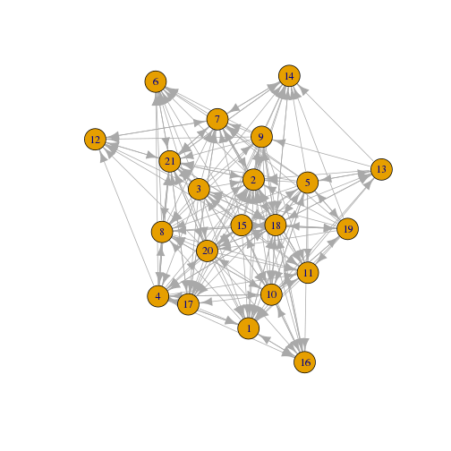
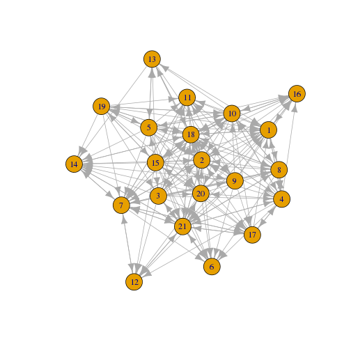
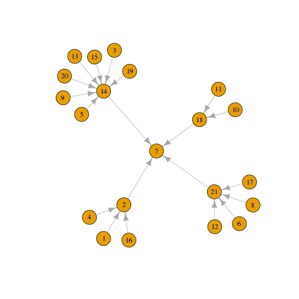
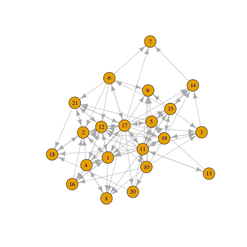
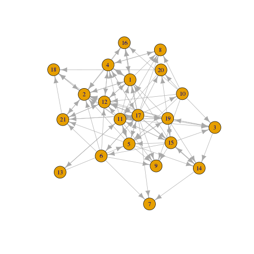

Lab 2
========================================================
author: 
date: 
autosize: true

First Slide
========================================================

For more details on authoring R presentations please visit <https://support.rstudio.com/hc/en-us/articles/200486468>.

- Bullet 1
- Bullet 2
- Bullet 3


========================================================

LAB 2: Methodological beginnings - Density, Reciprocity, Triads, 
Transitivity, and heterogeneity. Node and network statistics.


========================================================
Lab 2 

The purpose of this lab is to acquire basic cohesion 
metrics of density, reciprocity, reach, path distance, 
and transitivity. In addition, we'll develop triadic 
analyses and a measure of ego-network heterogenity. 

本實驗的目的是獲得密度，互易性，到達，路徑距離和傳遞性的基本內聚度量。 此外，我們將開發三元分析和自我 - 網絡異質性的度量。


LOAD DATA
========================================================

同 lab_1


```r
library(igraph)
library(NetData)
data(kracknets, package = "NetData")
```


========================================================

同 lab_1


```
   ego alter advice_tie friendship_tie reports_to_tie
2    1     2          1              1              1
4    1     4          1              1              0
8    1     8          1              1              0
12   1    12          0              1              0
16   1    16          1              1              0
18   1    18          1              0              0
```


```
IGRAPH DN-- 21 232 -- 
+ attr: name (v/c), advice_tie (e/n), friendship_tie (e/n),
| reports_to_tie (e/n)
```


Set vertex attributes
========================================================
conbine node attributes with 網路關係

同 lab_1


```r
# Set vertex attributes
for (i in V(krack_full)) {
	for (j in names(attributes)) {
		krack_full <- set.vertex.attribute(krack_full, j, index=i, attributes[i+1,j])
	}
}
summary(krack_full)
```

```
IGRAPH DN-- 21 232 -- 
+ attr: name (v/c), AGE (v/n), TENURE (v/n), LEVEL (v/n), DEPT
| (v/n), advice_tie (e/n), friendship_tie (e/n), reports_to_tie
| (e/n)
```


========================================================

同 lab_1


```
IGRAPH DN-- 21 190 -- 
+ attr: name (v/c), AGE (v/n), TENURE (v/n), LEVEL (v/n), DEPT
| (v/n), advice_tie (e/n), friendship_tie (e/n), reports_to_tie
| (e/n)
```




========================================================

同 lab_1


```
IGRAPH DN-- 21 102 -- 
+ attr: name (v/c), AGE (v/n), TENURE (v/n), LEVEL (v/n), DEPT
| (v/n), advice_tie (e/n), friendship_tie (e/n), reports_to_tie
| (e/n)
```




========================================================

同 lab_1


```
IGRAPH DN-- 21 20 -- 
+ attr: name (v/c), AGE (v/n), TENURE (v/n), LEVEL (v/n), DEPT
| (v/n), advice_tie (e/n), friendship_tie (e/n), reports_to_tie
| (e/n)
```




NODE-LEVEL STATISTICS - degree
========================================================
從一個 vertex v 指出去的箭頭個數 (其實也就是 v 的 successors 個數), 叫做 v 的 out-degree; 指向 v 的箭頭個數 (其實也就是 v 的 predecessors 個數), 叫做 v 的 in-degree。 

以好友名單為例，out-degree 越高, 表示好友名單越長; in-degree 越高, 表示人氣越旺 (很多人都將你列在好友名單內)


========================================================

當然也可以套用在其他的 (單邊網路關係 ?) 上，下面就是 krack_friendship


```r
# 2 號員工人氣最旺，大家都加他好朋友，大概是公司裡的好好先生（工具人？）
deg_friendship_in <- degree(krack_friendship, mode="in") 
deg_friendship_in
```

```
 1  2  3  4  5  6  7  8  9 10 11 12 13 14 15 16 17 18 19 20 21 
 8 10  5  5  6  2  3  5  6  1  6  8  1  5  4  4  6  4  5  3  5 
```


```r
plot(krack_friendship)
```




========================================================


```r
# 17 號員工認識最多人，大概是人資主管一類的
# 代表 21 位 user 中每一位 user 連出的 edge 數目
# 以好友名單來解釋就是 17 號員工加了很多人為好友

deg_friendship_out <- degree(krack_friendship, mode="out") 
deg_friendship_out
```

```
 1  2  3  4  5  6  7  8  9 10 11 12 13 14 15 16 17 18 19 20 21 
 5  3  2  6  7  6  0  1  0  7 13  4  2  2  8  2 18  1  9  2  4 
```


```r
plot(krack_friendship)
```




大家可自行練習
========================================================

使用 degree() 分析其他的關係表，並觀察其計算結果


```r
# krack_full

deg_full_in <- degree(krack_full, mode="in") 
deg_full_in
```

```
 1  2  3  4  5  6  7  8  9 10 11 12 13 14 15 16 17 18 19 20 21 
15 19  7 10  7 11 14 12  9 10 13 13  5 11  7  9 12 17  7  9 15 
```

```r
deg_full_out <- degree(krack_full, mode="out") 
deg_full_out
```

```
 1  2  3  4  5  6  7  8  9 10 11 12 13 14 15 16 17 18 19 20 21 
 7  5 16 12 16  6  8  8 13 16 14  5  7  5 20  4 18 17 12 12 11 
```


```r
# krack_advice

deg_advice_in <- degree(krack_advice, mode="in")
deg_advice_in
```

```
 1  2  3  4  5  6  7  8  9 10 11 12 13 14 15 16 17 18 19 20 21 
13 18  5  8  5 10 13 10  4  9 11  7  4 10  4  8  9 15  4  8 15 
```

```r
deg_advice_out <- degree(krack_advice, mode="out")
deg_advice_out
```

```
 1  2  3  4  5  6  7  8  9 10 11 12 13 14 15 16 17 18 19 20 21 
 6  3 15 12 15  1  8  8 13 14  3  2  6  4 20  4  5 17 11 12 11 
```


```r
# krack_reports_to

deg_reports_to_in <- degree(krack_reports_to, mode="in") 
deg_reports_to_in
```

```
 1  2  3  4  5  6  7  8  9 10 11 12 13 14 15 16 17 18 19 20 21 
 0  3  0  0  0  0  4  0  0  0  0  0  0  7  0  0  0  2  0  0  4 
```

```r
deg_reports_to_out <- degree(krack_reports_to, mode="out") 
deg_reports_to_out
```

```
 1  2  3  4  5  6  7  8  9 10 11 12 13 14 15 16 17 18 19 20 21 
 1  1  1  1  1  1  0  1  1  1  1  1  1  1  1  1  1  1  1  1  1 
```


reachability
========================================================

Reachability can only be computed on one vertex at a time. To
get graph-wide statistics, change the value of "vertex"
manually or write a for loop. (Remember that, unlike R objects,
igraph objects are numbered from 0.)

```
reachability <- function(g, m) {
	reach_mat = matrix(nrow = vcount(g), 
                       ncol = vcount(g))
	for (i in 1:vcount(g)) {
		reach_mat[i,] = 0
		this_node_reach <- subcomponent(g, (i - 1), mode = m)

		for (j in 1:(length(this_node_reach))) {
			alter = this_node_reach[j] + 1
			reach_mat[i, alter] = 1
		}
	}
	return(reach_mat)
}
```


reachability
========================================================
```
reach_friendship_in <- reachability(krack_friendship, 'in')
reach_friendship_in
```


reachability
========================================================
```
reach_friendship_out <- reachability(krack_friendship, 'out')
reach_friendship_out
```


大家可自行練習
========================================================

```
# krack_full

reach_full_in <- reachability(krack_full, 'in')
reach_full_in

reach_full_out <- reachability(krack_full, 'out')
reach_full_out
```

```
# krack_advice

reach_advice_in <- reachability(krack_advice, 'in')
reach_advice_in

reach_advice_out <- reachability(krack_advice, 'out')
reach_advice_out
```

```
# krack_reports_to

reach_reports_to_in <- reachability(krack_reports_to, 'in')
reach_reports_to_in

reach_reports_to_out <- reachability(krack_reports_to, 'out')
reach_reports_to_out
```


shortest.paths 差了幾層關係
========================================================
Often we want to know path distances between individuals in a network. 
This is often done by calculating geodesics, or shortest paths between
each ij pair. One can symmetrize the data to do this (see lab 1), or 
calculate it for outward and inward ties separately. Averaging geodesics 
for the entire network provides an average distance or sort of cohesiveness
score. Dichotomizing distances reveals reach, and an average of reach for 
a network reveals what percent of a network is connected in some way.

通常我們想知道網絡中個體之間的路徑距離。 這通常通過計算測地線或每個ij對之間的最短路徑來完成。 可以對數據進行對稱化（參見實驗1），或者分別計算向外和向內的關係。 對於整個網絡的平均測地線提供了平均距離或者內聚性得分的分類。 二分距離揭示了到達範圍，網絡的平均範圍顯示了以某種方式連接的網絡的百分比。


shortest.paths
========================================================

Compute shortest paths between each pair of nodes. 


```r
sp_friendship_in <- shortest.paths(krack_friendship, mode='in')
sp_friendship_in
```

```
   1 2 3 4 5 6   7 8   9 10 11 12 13 14 15 16 17 18 19 20 21
1  0 1 2 1 2 2 Inf 2 Inf  2  1  1  2  2  1  1  1  2  1  2  2
2  1 0 2 1 1 1 Inf 2 Inf  2  1  2  2  3  2  1  1  1  1  2  1
3  3 3 0 2 2 2 Inf 3 Inf  1  1  2  2  2  1  4  1  4  1  2  2
4  1 2 3 0 2 2 Inf 1 Inf  2  1  1  2  3  2  2  1  3  2  2  2
5  3 3 2 2 0 2 Inf 3 Inf  1  1  2  1  2  1  4  1  4  1  2  2
6  3 3 3 2 2 0 Inf 3 Inf  3  2  2  3  2  1  4  1  4  2  3  2
7  3 3 2 2 2 1   0 3 Inf  3  2  2  3  1  2  4  1  4  2  3  2
8  1 2 3 1 2 2 Inf 0 Inf  1  1  2  2  3  2  2  1  3  2  2  2
9  3 3 3 2 1 1 Inf 3   0  1  1  2  2  2  1  4  1  4  2  2  2
10 3 3 4 2 2 2 Inf 3 Inf  0  2  2  3  4  3  4  1  4  3  3  2
11 3 3 2 2 1 2 Inf 3 Inf  2  0  2  1  2  1  4  1  4  1  1  2
12 1 2 2 1 2 1 Inf 2 Inf  1  1  0  2  3  2  2  1  3  1  2  1
13 4 4 3 3 2 3 Inf 4 Inf  3  1  3  0  3  2  5  2  5  2  2  3
14 3 3 1 2 1 2 Inf 3 Inf  2  2  2  2  0  1  4  1  4  1  3  2
15 3 3 2 2 2 2 Inf 3 Inf  3  1  2  2  1  0  4  1  4  1  2  2
16 1 2 3 1 2 2 Inf 2 Inf  1  2  2  3  3  2  0  1  3  2  3  2
17 2 2 3 1 1 1 Inf 2 Inf  2  1  1  2  3  2  3  0  3  2  2  1
18 2 1 3 2 2 2 Inf 3 Inf  2  1  2  2  3  2  2  2  0  2  1  1
19 3 3 1 2 1 2 Inf 3 Inf  2  1  2  2  2  1  4  1  4  0  2  2
20 3 3 2 2 2 2 Inf 3 Inf  1  2  2  3  3  2  4  1  4  1  0  2
21 2 1 3 2 1 1 Inf 3 Inf  2  2  1  2  3  2  2  1  2  2  3  0
```

========================================================


```r
sp_friendship_out <- shortest.paths(krack_friendship, mode='out')
sp_friendship_out
```

```
     1   2   3   4   5   6   7   8   9  10  11  12  13  14  15  16  17  18
1    0   1   3   1   3   3   3   1   3   3   3   1   4   3   3   1   2   2
2    1   0   3   2   3   3   3   2   3   3   3   2   4   3   3   2   2   1
3    2   2   0   3   2   3   2   3   3   4   2   2   3   1   2   3   3   3
4    1   1   2   0   2   2   2   1   2   2   2   1   3   2   2   1   1   2
5    2   1   2   2   0   2   2   2   1   2   1   2   2   1   2   2   1   2
6    2   1   2   2   2   0   1   2   1   2   2   1   3   2   2   2   1   2
7  Inf Inf Inf Inf Inf Inf   0 Inf Inf Inf Inf Inf Inf Inf Inf Inf Inf Inf
8    2   2   3   1   3   3   3   0   3   3   3   2   4   3   3   2   2   3
9  Inf Inf Inf Inf Inf Inf Inf Inf   0 Inf Inf Inf Inf Inf Inf Inf Inf Inf
10   2   2   1   2   1   3   3   1   1   0   2   1   3   2   3   1   2   2
11   1   1   1   1   1   2   2   1   1   2   0   1   1   2   1   2   1   1
12   1   2   2   1   2   2   2   2   2   2   2   0   3   2   2   2   1   2
13   2   2   2   2   1   3   3   2   2   3   1   2   0   2   2   3   2   2
14   2   3   2   3   2   2   1   3   2   4   2   3   3   0   1   3   3   3
15   1   2   1   2   1   1   2   2   1   3   1   2   2   1   0   2   2   2
16   1   1   4   2   4   4   4   2   4   4   4   2   5   4   4   0   3   2
17   1   1   1   1   1   1   1   1   1   1   1   1   2   1   1   1   0   2
18   2   1   4   3   4   4   4   3   4   4   4   3   5   4   4   3   3   0
19   1   1   1   2   1   2   2   2   2   3   1   1   2   1   1   2   2   2
20   2   2   2   2   2   3   3   2   2   3   1   2   2   3   2   3   2   1
21   2   1   2   2   2   2   2   2   2   2   2   1   3   2   2   2   1   1
    19  20  21
1    3   3   2
2    3   3   1
3    1   2   3
4    2   2   2
5    1   2   1
6    2   2   1
7  Inf Inf Inf
8    3   3   3
9  Inf Inf Inf
10   2   1   2
11   1   2   2
12   2   2   1
13   2   3   2
14   2   3   3
15   1   2   2
16   4   4   2
17   1   1   1
18   4   4   2
19   0   1   2
20   2   0   3
21   2   2   0
```


大家可自行練習
========================================================


```r
# krack_full in and out

sp_full_in <- shortest.paths(krack_full, mode='in')
sp_full_in
```

```
   1 2 3 4 5 6 7 8 9 10 11 12 13 14 15 16 17 18 19 20 21
1  0 1 1 1 1 2 2 2 1  1  1  1  1  2  1  1  1  1  1  1  2
2  1 0 1 1 1 1 1 1 1  1  1  2  1  1  1  1  1  1  1  1  1
3  2 2 0 2 2 2 2 2 2  1  1  2  2  2  1  2  1  1  1  2  1
4  1 2 1 0 2 2 2 1 2  1  1  1  2  2  1  2  1  1  2  2  1
5  2 2 2 2 0 2 2 2 2  1  1  2  1  2  1  2  1  1  1  2  2
6  2 1 1 1 1 0 1 1 1  2  2  2  2  2  1  2  1  2  2  1  1
7  2 1 1 2 1 1 0 1 1  2  1  1  2  1  1  2  1  1  1  2  1
8  1 2 1 1 1 2 2 0 1  1  1  2  2  2  1  2  1  1  2  1  1
9  2 2 1 2 1 1 2 2 0  1  1  2  1  2  1  2  1  1  2  2  2
10 2 2 1 1 1 2 2 1 1  0  2  2  2  2  1  1  1  1  1  2  2
11 2 2 1 1 1 2 1 1 1  1  0  2  1  2  1  2  1  1  1  1  2
12 1 2 1 1 2 1 1 2 1  1  1  0  2  2  1  2  1  2  1  1  1
13 2 2 2 2 1 3 2 2 2  1  1  3  0  2  1  2  2  1  2  2  2
14 2 2 1 2 1 2 1 2 1  2  2  2  1  0  1  2  1  1  1  1  1
15 2 2 2 2 2 2 2 2 2  1  1  2  2  1  0  2  1  1  1  1  2
16 1 2 2 1 1 2 2 2 1  1  2  2  2  2  1  0  1  1  2  1  2
17 2 2 1 1 1 1 1 2 1  1  1  1  2  2  1  2  0  2  2  1  1
18 1 1 1 1 1 2 1 1 1  1  1  2  1  1  1  1  2  0  1  1  1
19 2 2 1 2 1 2 2 2 2  1  1  2  2  2  1  2  1  1  0  2  2
20 2 2 1 1 1 2 2 2 2  1  2  2  2  2  1  2  1  1  1  0  1
21 1 1 1 1 1 1 1 1 1  2  2  1  2  1  1  2  1  1  2  1  0
```

```r
sp_full_out <- shortest.paths(krack_full, mode='out')
sp_full_out
```

```
   1 2 3 4 5 6 7 8 9 10 11 12 13 14 15 16 17 18 19 20 21
1  0 1 2 1 2 2 2 1 2  2  2  1  2  2  2  1  2  1  2  2  1
2  1 0 2 2 2 1 1 2 2  2  2  2  2  2  2  2  2  1  2  2  1
3  1 1 0 1 2 1 1 1 1  1  1  1  2  1  2  2  1  1  1  1  1
4  1 1 2 0 2 1 2 1 2  1  1  1  2  2  2  1  1  1  2  1  1
5  1 1 2 2 0 1 1 1 1  1  1  2  1  1  2  1  1  1  1  1  1
6  2 1 2 2 2 0 1 2 1  2  2  1  3  2  2  2  1  2  2  2  1
7  2 1 2 2 2 1 0 2 2  2  1  1  2  1  2  2  1  1  2  2  1
8  2 1 2 1 2 1 1 0 2  1  1  2  2  2  2  2  2  1  2  2  1
9  1 1 2 2 2 1 1 1 0  1  1  1  2  1  2  1  1  1  2  2  1
10 1 1 1 1 1 2 2 1 1  0  1  1  1  2  1  1  1  1  1  1  2
11 1 1 1 1 1 2 1 1 1  2  0  1  1  2  1  2  1  1  1  2  2
12 1 2 2 1 2 2 1 2 2  2  2  0  3  2  2  2  1  2  2  2  1
13 1 1 2 2 1 2 2 2 1  2  1  2  0  1  2  2  2  1  2  2  2
14 2 1 2 2 2 2 1 2 2  2  2  2  2  0  1  2  2  1  2  2  1
15 1 1 1 1 1 1 1 1 1  1  1  1  1  1  0  1  1  1  1  1  1
16 1 1 2 2 2 2 2 2 2  1  2  2  2  2  2  0  2  1  2  2  2
17 1 1 1 1 1 1 1 1 1  1  1  1  2  1  1  1  0  2  1  1  1
18 1 1 1 1 1 2 1 1 1  1  1  2  1  1  1  1  2  0  1  1  1
19 1 1 1 2 1 2 1 2 2  1  1  1  2  1  1  2  2  1  0  1  2
20 1 1 2 2 2 1 2 1 2  2  1  1  2  1  1  1  1  1  2  0  1
21 2 1 1 1 2 1 1 1 2  2  2  1  2  1  2  2  1  1  2  1  0
```


```r
# krack_advice in and out

sp_advice_in <- shortest.paths(krack_advice, mode='in')
sp_advice_in
```

```
   1 2 3 4 5 6 7 8 9 10 11 12 13 14 15 16 17 18 19 20 21
1  0 3 1 1 1 3 2 2 1  1  1  3  1  2  1  1  1  1  1  1  2
2  1 0 1 1 1 2 1 1 1  1  1  2  1  1  1  1  1  1  1  1  1
3  2 2 0 2 2 2 2 2 2  1  3  2  2  2  1  2  2  1  1  2  1
4  1 2 1 0 2 2 2 1 2  1  2  2  2  2  1  2  1  1  2  2  1
5  2 3 2 2 0 3 2 2 2  1  3  3  1  2  1  2  3  1  1  2  2
6  2 1 1 1 1 0 1 1 1  2  2  2  2  2  1  2  2  2  2  1  1
7  2 1 1 2 1 2 0 1 1  2  1  1  2  1  1  2  1  1  1  2  1
8  1 2 1 1 1 2 2 0 1  1  2  2  2  2  1  2  2  1  2  1  1
9  2 3 1 2 2 3 2 2 0  2  3  3  1  2  1  2  3  1  2  2  2
10 2 3 1 1 1 3 2 1 1  0  3  3  2  2  1  1  2  1  1  2  2
11 2 2 1 1 1 3 1 1 1  1  0  2  2  2  1  2  2  1  1  1  2
12 2 2 1 1 2 2 1 2 1  2  2  0  2  2  1  3  2  2  2  1  1
13 2 3 2 2 1 3 2 2 2  1  3  3  0  2  1  2  3  1  2  2  2
14 2 2 1 2 1 2 1 2 1  2  2  2  1  0  1  2  2  1  1  1  1
15 2 3 2 2 2 3 2 2 2  1  3  3  2  2  0  2  3  1  1  1  2
16 1 3 2 1 1 3 2 2 1  1  2  3  2  2  1  0  2  1  2  1  2
17 2 2 1 1 1 2 1 2 1  1  2  2  2  2  1  2  0  2  2  1  1
18 1 2 1 1 1 2 1 1 1  1  2  2  1  1  1  1  2  0  1  1  1
19 2 3 2 2 1 3 2 2 2  1  3  3  2  2  1  2  3  1  0  2  2
20 2 2 1 1 1 2 2 2 2  1  3  2  2  2  1  2  2  1  1  0  1
21 1 1 1 1 1 1 1 1 1  2  2  1  2  1  1  2  1  1  2  1  0
```

```r
sp_advice_out <- shortest.paths(krack_advice, mode='out')
sp_advice_out
```

```
   1 2 3 4 5 6 7 8 9 10 11 12 13 14 15 16 17 18 19 20 21
1  0 1 2 1 2 2 2 1 2  2  2  2  2  2  2  1  2  1  2  2  1
2  3 0 2 2 3 1 1 2 3  3  2  2  3  2  3  3  2  2  3  2  1
3  1 1 0 1 2 1 1 1 1  1  1  1  2  1  2  2  1  1  2  1  1
4  1 1 2 0 2 1 2 1 2  1  1  1  2  2  2  1  1  1  2  1  1
5  1 1 2 2 0 1 1 1 2  1  1  2  1  1  2  1  1  1  1  1  1
6  3 2 2 2 3 0 2 2 3  3  3  2  3  2  3  3  2  2  3  2  1
7  2 1 2 2 2 1 0 2 2  2  1  1  2  1  2  2  1  1  2  2  1
8  2 1 2 1 2 1 1 0 2  1  1  2  2  2  2  2  2  1  2  2  1
9  1 1 2 2 2 1 1 1 0  1  1  1  2  1  2  1  1  1  2  2  1
10 1 1 1 1 1 2 2 1 2  0  1  2  1  2  1  1  1  1  1  1  2
11 1 1 3 2 3 2 1 2 3  3  0  2  3  2  3  2  2  2  3  3  2
12 3 2 2 2 3 2 1 2 3  3  2  0  3  2  3  3  2  2  3  2  1
13 1 1 2 2 1 2 2 2 1  2  2  2  0  1  2  2  2  1  2  2  2
14 2 1 2 2 2 2 1 2 2  2  2  2  2  0  2  2  2  1  2  2  1
15 1 1 1 1 1 1 1 1 1  1  1  1  1  1  0  1  1  1  1  1  1
16 1 1 2 2 2 2 2 2 2  1  2  3  2  2  2  0  2  1  2  2  2
17 1 1 2 1 3 2 1 2 3  2  2  2  3  2  3  2  0  2  3  2  1
18 1 1 1 1 1 2 1 1 1  1  1  2  1  1  1  1  2  0  1  1  1
19 1 1 1 2 1 2 1 2 2  1  1  2  2  1  1  2  2  1  0  1  2
20 1 1 2 2 2 1 2 1 2  2  1  1  2  1  1  1  1  1  2  0  1
21 2 1 1 1 2 1 1 1 2  2  2  1  2  1  2  2  1  1  2  1  0
```


```r
# krack_reports_to in and out

sp_reports_to_in <- shortest.paths(krack_reports_to, mode='in')
sp_reports_to_out <- shortest.paths(krack_reports_to, mode='out')
sp_reports_to_in
```

```
     1   2   3   4   5   6   7   8   9  10  11  12  13  14  15  16  17  18
1    0 Inf Inf Inf Inf Inf Inf Inf Inf Inf Inf Inf Inf Inf Inf Inf Inf Inf
2    1   0 Inf   1 Inf Inf Inf Inf Inf Inf Inf Inf Inf Inf Inf   1 Inf Inf
3  Inf Inf   0 Inf Inf Inf Inf Inf Inf Inf Inf Inf Inf Inf Inf Inf Inf Inf
4  Inf Inf Inf   0 Inf Inf Inf Inf Inf Inf Inf Inf Inf Inf Inf Inf Inf Inf
5  Inf Inf Inf Inf   0 Inf Inf Inf Inf Inf Inf Inf Inf Inf Inf Inf Inf Inf
6  Inf Inf Inf Inf Inf   0 Inf Inf Inf Inf Inf Inf Inf Inf Inf Inf Inf Inf
7    2   1   2   2   2   2   0   2   2   2   2   2   2   1   2   2   2   1
8  Inf Inf Inf Inf Inf Inf Inf   0 Inf Inf Inf Inf Inf Inf Inf Inf Inf Inf
9  Inf Inf Inf Inf Inf Inf Inf Inf   0 Inf Inf Inf Inf Inf Inf Inf Inf Inf
10 Inf Inf Inf Inf Inf Inf Inf Inf Inf   0 Inf Inf Inf Inf Inf Inf Inf Inf
11 Inf Inf Inf Inf Inf Inf Inf Inf Inf Inf   0 Inf Inf Inf Inf Inf Inf Inf
12 Inf Inf Inf Inf Inf Inf Inf Inf Inf Inf Inf   0 Inf Inf Inf Inf Inf Inf
13 Inf Inf Inf Inf Inf Inf Inf Inf Inf Inf Inf Inf   0 Inf Inf Inf Inf Inf
14 Inf Inf   1 Inf   1 Inf Inf Inf   1 Inf Inf Inf   1   0   1 Inf Inf Inf
15 Inf Inf Inf Inf Inf Inf Inf Inf Inf Inf Inf Inf Inf Inf   0 Inf Inf Inf
16 Inf Inf Inf Inf Inf Inf Inf Inf Inf Inf Inf Inf Inf Inf Inf   0 Inf Inf
17 Inf Inf Inf Inf Inf Inf Inf Inf Inf Inf Inf Inf Inf Inf Inf Inf   0 Inf
18 Inf Inf Inf Inf Inf Inf Inf Inf Inf   1   1 Inf Inf Inf Inf Inf Inf   0
19 Inf Inf Inf Inf Inf Inf Inf Inf Inf Inf Inf Inf Inf Inf Inf Inf Inf Inf
20 Inf Inf Inf Inf Inf Inf Inf Inf Inf Inf Inf Inf Inf Inf Inf Inf Inf Inf
21 Inf Inf Inf Inf Inf   1 Inf   1 Inf Inf Inf   1 Inf Inf Inf Inf   1 Inf
    19  20  21
1  Inf Inf Inf
2  Inf Inf Inf
3  Inf Inf Inf
4  Inf Inf Inf
5  Inf Inf Inf
6  Inf Inf Inf
7    2   2   1
8  Inf Inf Inf
9  Inf Inf Inf
10 Inf Inf Inf
11 Inf Inf Inf
12 Inf Inf Inf
13 Inf Inf Inf
14   1   1 Inf
15 Inf Inf Inf
16 Inf Inf Inf
17 Inf Inf Inf
18 Inf Inf Inf
19   0 Inf Inf
20 Inf   0 Inf
21 Inf Inf   0
```

```r
sp_reports_to_out
```

```
     1   2   3   4   5   6 7   8   9  10  11  12  13  14  15  16  17  18
1    0   1 Inf Inf Inf Inf 2 Inf Inf Inf Inf Inf Inf Inf Inf Inf Inf Inf
2  Inf   0 Inf Inf Inf Inf 1 Inf Inf Inf Inf Inf Inf Inf Inf Inf Inf Inf
3  Inf Inf   0 Inf Inf Inf 2 Inf Inf Inf Inf Inf Inf   1 Inf Inf Inf Inf
4  Inf   1 Inf   0 Inf Inf 2 Inf Inf Inf Inf Inf Inf Inf Inf Inf Inf Inf
5  Inf Inf Inf Inf   0 Inf 2 Inf Inf Inf Inf Inf Inf   1 Inf Inf Inf Inf
6  Inf Inf Inf Inf Inf   0 2 Inf Inf Inf Inf Inf Inf Inf Inf Inf Inf Inf
7  Inf Inf Inf Inf Inf Inf 0 Inf Inf Inf Inf Inf Inf Inf Inf Inf Inf Inf
8  Inf Inf Inf Inf Inf Inf 2   0 Inf Inf Inf Inf Inf Inf Inf Inf Inf Inf
9  Inf Inf Inf Inf Inf Inf 2 Inf   0 Inf Inf Inf Inf   1 Inf Inf Inf Inf
10 Inf Inf Inf Inf Inf Inf 2 Inf Inf   0 Inf Inf Inf Inf Inf Inf Inf   1
11 Inf Inf Inf Inf Inf Inf 2 Inf Inf Inf   0 Inf Inf Inf Inf Inf Inf   1
12 Inf Inf Inf Inf Inf Inf 2 Inf Inf Inf Inf   0 Inf Inf Inf Inf Inf Inf
13 Inf Inf Inf Inf Inf Inf 2 Inf Inf Inf Inf Inf   0   1 Inf Inf Inf Inf
14 Inf Inf Inf Inf Inf Inf 1 Inf Inf Inf Inf Inf Inf   0 Inf Inf Inf Inf
15 Inf Inf Inf Inf Inf Inf 2 Inf Inf Inf Inf Inf Inf   1   0 Inf Inf Inf
16 Inf   1 Inf Inf Inf Inf 2 Inf Inf Inf Inf Inf Inf Inf Inf   0 Inf Inf
17 Inf Inf Inf Inf Inf Inf 2 Inf Inf Inf Inf Inf Inf Inf Inf Inf   0 Inf
18 Inf Inf Inf Inf Inf Inf 1 Inf Inf Inf Inf Inf Inf Inf Inf Inf Inf   0
19 Inf Inf Inf Inf Inf Inf 2 Inf Inf Inf Inf Inf Inf   1 Inf Inf Inf Inf
20 Inf Inf Inf Inf Inf Inf 2 Inf Inf Inf Inf Inf Inf   1 Inf Inf Inf Inf
21 Inf Inf Inf Inf Inf Inf 1 Inf Inf Inf Inf Inf Inf Inf Inf Inf Inf Inf
    19  20  21
1  Inf Inf Inf
2  Inf Inf Inf
3  Inf Inf Inf
4  Inf Inf Inf
5  Inf Inf Inf
6  Inf Inf   1
7  Inf Inf Inf
8  Inf Inf   1
9  Inf Inf Inf
10 Inf Inf Inf
11 Inf Inf Inf
12 Inf Inf   1
13 Inf Inf Inf
14 Inf Inf Inf
15 Inf Inf Inf
16 Inf Inf Inf
17 Inf Inf   1
18 Inf Inf Inf
19   0 Inf Inf
20 Inf   0 Inf
21 Inf Inf   0
```


========================================================
```
# Assemble node-level stats into single data frame for export as CSV.

# First, we have to compute average values by node for reachability and
# shortest path. (We don't have to do this for degree because it is 
# already expressed as a node-level value.)
reach_full_in_vec <- vector()
reach_full_out_vec <- vector()
reach_advice_in_vec <- vector()
reach_advice_out_vec <- vector()
reach_friendship_in_vec <- vector()
reach_friendship_out_vec <- vector()
reach_reports_to_in_vec <- vector()
reach_reports_to_out_vec <- vector()
```


========================================================


```r
sp_full_in_vec <- vector()
sp_full_out_vec <- vector()
sp_advice_in_vec <- vector()
sp_advice_out_vec <- vector()
sp_friendship_in_vec <- vector()
sp_friendship_out_vec <- vector()
sp_reports_to_in_vec <- vector()
sp_reports_to_out_vec <- vector()
```


========================================================
```
for (i in 1:vcount(krack_full)) {
	reach_full_in_vec[i] <- mean(reach_full_in[i,])
	reach_full_out_vec[i] <- mean(reach_full_out[i,])
	reach_advice_in_vec[i] <- mean(reach_advice_in[i,])
	reach_advice_out_vec[i] <- mean(reach_advice_out[i,])
	reach_friendship_in_vec[i] <- mean(reach_friendship_in[i,])
	reach_friendship_out_vec[i] <- mean(reach_friendship_out[i,])
	reach_reports_to_in_vec[i] <- mean(reach_reports_to_in[i,])
	reach_reports_to_out_vec[i] <- mean(reach_reports_to_out[i,])

	sp_full_in_vec[i] <- mean(sp_full_in[i,])
	sp_full_out_vec[i] <- mean(sp_full_out[i,])
	sp_advice_in_vec[i] <- mean(sp_advice_in[i,])
	sp_advice_out_vec[i] <- mean(sp_advice_out[i,])
	sp_friendship_in_vec[i] <- mean(sp_friendship_in[i,])
	sp_friendship_out_vec[i] <- mean(sp_friendship_out[i,])
	sp_reports_to_in_vec[i] <- mean(sp_reports_to_in[i,])
	sp_reports_to_out_vec[i] <- mean(sp_reports_to_out[i,])
}
```


========================================================

```
# Next, we assemble all of the vectors of node-levelvalues into a 
# single data frame, which we can export as a CSV to our working
# directory.
node_stats_df <- cbind(deg_full_in,
                       deg_full_out,
                       deg_advice_in,
                       deg_advice_out,
                       deg_friendship_in,
                       deg_friendship_out,
                       deg_reports_to_in,
                       deg_reports_to_out, 

                       reach_full_in_vec, 
                       reach_full_out_vec, 
                       reach_advice_in_vec, 
                       reach_advice_out_vec, 
                       reach_friendship_in_vec, 
                       reach_friendship_out_vec, 
                       reach_reports_to_in_vec, 
                       reach_reports_to_out_vec, 

                       sp_full_in_vec, 
                       sp_full_out_vec, 
                       sp_advice_in_vec, 
                       sp_advice_out_vec, 
                       sp_friendship_in_vec, 
                       sp_friendship_out_vec, 
                       sp_reports_to_in_vec, 
                       sp_reports_to_out_vec)

write.csv(node_stats_df, 'krack_node_stats.csv')
```


Question
========================================================

- What do these statistics tell us about each network and its individuals in general? 


 
NETWORK-LEVEL STATISTICS
========================================================

Many initial analyses of networks begin with distances and reach, 
and then move towards global summary statistics of the network. 

As a reminder, entering a question mark followed by a function 
name (e.g., ?graph.density) pulls up the help file for that function.
This can be helpful to understand how, exactly, stats are calculated.

許多對網絡的初始分析從距離和距離開始，然後轉向網絡的全局匯總統計。
作為提醒，輸入問號後跟一個函數名稱（例如，？graph.density）將拉出該函數的幫助文件。
這有助於了解如何計算統計信息。


Degree
========================================================


```r
data.frame(mean(deg_friendship_in), sd(deg_friendship_in))
```

```
  mean.deg_friendship_in. sd.deg_friendship_in.
1                4.857143              2.220039
```


```r
#summary(deg_friendship_in)
```


```r
data.frame(mean(deg_friendship_out), sd(deg_friendship_out))
```

```
  mean.deg_friendship_out. sd.deg_friendship_out.
1                 4.857143               4.475329
```


```r
#summary(deg_friendship_out)
```


大家可自行練習
========================================================


```r
data.frame(mean(deg_full_in), sd(deg_full_in))
```

```
  mean.deg_full_in. sd.deg_full_in.
1          11.04762        3.639728
```

```r
data.frame(mean(deg_full_out), sd(deg_full_out))
```

```
  mean.deg_full_out. sd.deg_full_out.
1           11.04762         4.944453
```


```r
data.frame(mean(deg_advice_in), sd(deg_advice_in))
```

```
  mean.deg_advice_in. sd.deg_advice_in.
1            9.047619          4.067876
```

```r
data.frame(mean(deg_advice_out), sd(deg_advice_out))
```

```
  mean.deg_advice_out. sd.deg_advice_out.
1             9.047619           5.454138
```


```r
data.frame(mean(deg_reports_to_in), sd(deg_reports_to_in))
```

```
  mean.deg_reports_to_in. sd.deg_reports_to_in.
1                0.952381              1.935877
```

```r
data.frame(mean(deg_reports_to_out), sd(deg_reports_to_out))
```

```
  mean.deg_reports_to_out. sd.deg_reports_to_out.
1                 0.952381              0.2182179
```

Shortest paths
========================================================

***Why do in and out come up with the same results?
In and out shortest paths are simply transposes of one another; 
thus, when we compute statistics across the whole network they have to be the same.


Shortest paths
========================================================


```r
data.frame(mean(sp_friendship_in[which(sp_friendship_in != Inf)]), 
     sd(sp_friendship_in[which(sp_friendship_in != Inf)]))
```

```
  mean.sp_friendship_in.which.sp_friendship_in....Inf...
1                                               1.992519
  sd.sp_friendship_in.which.sp_friendship_in....Inf...
1                                            0.9911831
```

```r
data.frame(mean(sp_friendship_out[which(sp_friendship_out != Inf)]),
           sd(sp_friendship_out[which(sp_friendship_out != Inf)]))
```

```
  mean.sp_friendship_out.which.sp_friendship_out....Inf...
1                                                 1.992519
  sd.sp_friendship_out.which.sp_friendship_out....Inf...
1                                              0.9911831
```


大家可自行練習
========================================================


```r
# sp_full_in

data.frame(mean(sp_full_in[which(sp_full_in != Inf)]), 
           sd(sp_full_in[which(sp_full_in != Inf)]))
```

```
  mean.sp_full_in.which.sp_full_in....Inf...
1                                    1.38322
  sd.sp_full_in.which.sp_full_in....Inf...
1                                 0.584333
```

```r
data.frame(mean(sp_full_out[which(sp_full_out != Inf)]), 
           sd(sp_full_out[which(sp_full_out != Inf)]))
```

```
  mean.sp_full_out.which.sp_full_out....Inf...
1                                      1.38322
  sd.sp_full_out.which.sp_full_out....Inf...
1                                   0.584333
```


```r
# sp_advice_in

data.frame(mean(sp_advice_in[which(sp_advice_in != Inf)]), 
           sd(sp_advice_in[which(sp_advice_in != Inf)]))
```

```
  mean.sp_advice_in.which.sp_advice_in....Inf...
1                                       1.562358
  sd.sp_advice_in.which.sp_advice_in....Inf...
1                                    0.7206928
```

```r
data.frame(mean(sp_advice_out[which(sp_advice_out != Inf)]), 
           sd(sp_advice_out[which(sp_advice_out != Inf)]))
```

```
  mean.sp_advice_out.which.sp_advice_out....Inf...
1                                         1.562358
  sd.sp_advice_out.which.sp_advice_out....Inf...
1                                      0.7206928
```


```r
# sp_reports_to

data.frame(mean(sp_reports_to_in[which(sp_reports_to_in != Inf)]), 
           sd(sp_reports_to_in[which(sp_reports_to_in != Inf)]))
```

```
  mean.sp_reports_to_in.which.sp_reports_to_in....Inf...
1                                              0.9122807
  sd.sp_reports_to_in.which.sp_reports_to_in....Inf...
1                                            0.8080113
```

```r
data.frame(mean(sp_reports_to_out[which(sp_reports_to_out != Inf)]), 
           sd(sp_reports_to_out[which(sp_reports_to_out != Inf)]))
```

```
  mean.sp_reports_to_out.which.sp_reports_to_out....Inf...
1                                                0.9122807
  sd.sp_reports_to_out.which.sp_reports_to_out....Inf...
1                                              0.8080113
```


Reachability
========================================================

```
mean(reach_friendship_in[which(reach_friendship_in != Inf)])
sd(reach_friendship_in[which(reach_friendship_in != Inf)])
mean(reach_friendship_out[which(reach_friendship_out != Inf)])
sd(reach_friendship_out[which(reach_friendship_out != Inf)])
```


大家可自行練習
========================================================
```
mean(reach_full_in[which(reach_full_in != Inf)])
sd(reach_full_in[which(reach_full_in != Inf)])
mean(reach_full_out[which(reach_full_out != Inf)])
sd(reach_full_out[which(reach_full_out != Inf)])
```

```
mean(reach_advice_in[which(reach_advice_in != Inf)])
sd(reach_advice_in[which(reach_advice_in != Inf)])
mean(reach_advice_out[which(reach_advice_out != Inf)])
sd(reach_advice_out[which(reach_advice_out != Inf)])
```

```
mean(reach_reports_to_in[which(reach_reports_to_in != Inf)])
sd(reach_reports_to_in[which(reach_reports_to_in != Inf)])
mean(reach_reports_to_out[which(reach_reports_to_out != Inf)])
sd(reach_reports_to_out[which(reach_reports_to_out != Inf)])
```


Density 密度
========================================================
- <https://www.quora.com/What-is-graph-density>

圖上的節點可以表示人/興趣/事物。綠線表示圖上這些節點之間的連接，從圖像中我們可以看出，人們可以與其他人（例如，用戶A是用戶B的朋友）共享圖形上的邊緣，或者可以在人和對象之間共享邊/東西（例如用戶A喜歡可口可樂）。

從學術角度看，圖密度將被定義為邊緣數量和可能邊緣數量的比率。如果我是像Facebook這樣的服務的用戶，他們計算100可能的邊緣為我形成，但我只有5個邊緣，然後我有一個相對較低的圖密度。通過增加邊緣的數量，增加圖密度，並且密度的增加帶來各種好處。

在關於大註冊頁面的這個問題的圖密度：什麼是在網絡上偉大的新用戶體驗流的一些例子？ - >理想情況下，您構建一個註冊過程，盡可能快地增加用戶的圖密度，盡可能多的相關性。

在Facebook條款中，這意味著盡快為新用戶獲得盡可能多的朋友。當您提高互動率（即圖表密度）時，您可以假設您的產品的整體用戶參與度/參與度有所增加。這是一個摘錄自Mark Zuckerberg在TechCrunch上的採訪：

“運營的關鍵部分之一是”增長團隊“，這是一個集中的團隊，Facebook設置為幫助用戶保持聯繫，例如，Zuck說，通過這個團隊，公司發現成員需要至少有十個朋友在新聞源中有足夠的內容回到網站，所以Facebook重新設計了網站的整個流程，當有人登錄時，專注於讓人們找到其他人來連接，以便人們可以連接Zuckerberg說，公司已經將這個想法出口給了另一家創業公司，包括Dropbox。“一旦你有一個你喜歡的產品，你需要集中管理事物以繼續增長。


========================================================


```r
graph.density(krack_friendship)
```

```
[1] 0.2428571
```


```r
graph.density(krack_full)
```

```
[1] 0.552381
```

```r
graph.density(krack_advice)
```

```
[1] 0.452381
```

```r
graph.density(krack_reports_to)
```

```
[1] 0.04761905
```


Reciprocity (互惠?)
========================================================


```r
reciprocity(krack_friendship)
```

```
[1] 0.4509804
```


```r
reciprocity(krack_full)
```

```
[1] 0.6293103
```

```r
reciprocity(krack_advice)
```

```
[1] 0.4736842
```

```r
reciprocity(krack_reports_to)
```

```
[1] 0
```


Transitivity (傳遞性?)
========================================================


```r
transitivity(krack_friendship)
```

```
[1] 0.4714946
```


```r
transitivity(krack_full)
```

```
[1] 0.7863578
```

```r
transitivity(krack_advice)
```

```
[1] 0.7345088
```

```r
transitivity(krack_reports_to)
```

```
[1] 0
```


========================================================


```r
# Triad census. Here we'll first build a vector of labels for 
# the different triad types. Then we'll combine this vector
# with the triad censuses for the different networks, which 
# we'll export as a CSV.

census_labels = c('003',
                  '012',
                  '102',
                  '021D',
                  '021U',
                  '021C',
                  '111D',
                  '111U',
                  '030T',
                  '030C',
                  '201',
                  '120D',
                  '120U',
                  '120C',
                  '210',
                  '300')
tc_full <- triad.census(krack_full)
tc_advice <- triad.census(krack_advice)
tc_friendship <- triad.census(krack_friendship)
tc_reports_to <- triad.census(krack_reports_to)

triad_df <- data.frame(census_labels,
                       tc_full, 
                       tc_advice, 
                       tc_friendship,
                       tc_reports_to)
```


```r
triad_df
```

```
   census_labels tc_full tc_advice tc_friendship tc_reports_to
1            003      29        74           376          1003
2            012      99       153           366           274
3            102      93        90           143             0
4           021D      90       160           114             0
5           021U      57        86            34            37
6           021C      28        49            35            16
7           111D      72        59            39             0
8           111U     130       101           101             0
9           030T     121       190            23             0
10          030C       0         2             0             0
11           201     121        72            20             0
12          120D      77        62            16             0
13          120U      98        78            25             0
14          120C      31        17             9             0
15           210     208       107            23             0
16           300      76        30             6             0
```


========================================================


```r
# To export any of these vectors to a CSV for use in another program, simply
# use the write.csv() command:
write.csv(triad_df, 'krack_triads.csv')
```


Question
========================================================

- How do the three networks differ on network statictics? 
- What does the triad census tell us? Can you calculate the likelihood of any triad's occurrence? 
- See the back of Wasserman and Faust and its section on triads. Calculate the degree of clustering and hierarchy in Excel. 
- What do we learn from that?


HETEROGENEITY (異質性?)
========================================================

# Miller and McPherson write about processes of homophily and
# here we take a brief look at one version of this issue. 
# In particular, we look at the extent to which each actor's
# "associates" (friend, advisor, boos) are heterogenous or not.

# We'll use a statistic called the IQV, or Index of Qualitative
# Variation. This is just an implementation of Blau's Index of
# Heterogeneity (known to economists as the Herfindahl-Hirschman
# index), normalized so that perfect heterogeneity (i.e., equal 
# distribution across categories) equals 1.

# NOTE that this code only works with categorical variables that 
# have been numerically coded to integer values that ascend
# sequentially from 0; you may have to recode your data to get this
# to work properly.
# We are interested in many of the attributes of nodes.  To save 
# time and to make our lives better we are going to create a function
# that will provide an IQV statistic for any network and for
# any categorical variable.  A function is a simple way to
# create code that is both reusable and easier to edit.

# Functions have names and receive arguments.  For example,
# anytime you call table() you are calling the table function.
# We could write code to duplicate the table function for each
# of our variables, but it is faster to write a single general tool
# that will provide frequencies for any variable. If I have
# a dataframe with the variable gender and I want to see the
# split of males and females I would pass the argument
# "dataframe$gender" to the table function. We follow a
# similar model here. Understanding each step is less important
# than understanding the usefulness and power of functions.

get_iqvs <- function(graph, attribute) {

#we have now defined a function, get_iqvs, that will take the
# graph "graph" and find the iqv statistic for the categorical
# variable "attribute." Within this function whenever we use the 
#variables graph or attribute they correspond to the graph and
# variable we passed (provided) to the function

mat <- get.adjacency(graph)
				
# To make this function work on a wide variety of variables we
# find out how many coded levels (unique responses) exist for
# the attribute variable programatically

	attr_levels = get.vertex.attribute(graph,
	                                   attribute,
	                                   V(graph))
	
	num_levels = length(unique(attr_levels))
	iqvs = rep(0, nrow(mat))

# Now that we know how many levels exist we want to loop
# (go through) each actor in the network. Loops iterate through
# each value in a range.  Here we are looking through each ego
# in the range of egos starting at the first and ending at the
# last.  The function nrow provides the number of rows in an
# object and the ":" opperand specifies the range.  Between
# the curly braces of the for loop ego will represent exactly
# one value between 1 and the number of rows in the graph
# object, iterating by one during each execution of the loop.

	for (ego in 1:nrow(mat)) {
		
		# initialize actor-specific variables
		alter_attr_counts = rep(0, num_levels)
		num_alters_this_ego = 0
		sq_fraction_sum = 0

# For each ego we want to check each tied alter for the same
# level on the variable attribute as the ego.
	
		for (alter in 1:ncol(mat)) {
			
			# only examine alters that are actually tied to ego
			if (mat[ego, alter] == 1) {
				
				num_alters_this_ego = num_alters_this_ego + 1

				# get the alter's level on the attribute 
				alter_attr = get.vertex.attribute(graph, 
				    attribute, (alter - 1))

				# increment the count of alters with this level
				# of the attribute by 1
				alter_attr_counts[alter_attr + 1] =
				    alter_attr_counts[alter_attr + 1] + 1
			}
		}

		# now that we're done looping through all of the alters,
		# get the squared fraction for each level of the attribute
		# out of the total number of attributes
		for (i in 1:num_levels) {
			attr_fraction = alter_attr_counts[i] /
			    num_alters_this_ego
			sq_fraction_sum = sq_fraction_sum + attr_fraction ^ 2
		}
		
		# now we can compute the ego's blau index...
		blau_index = 1 - sq_fraction_sum
		
		# and the ego's IQV, which is just a normalized blau index
		iqvs[ego] = blau_index / (1 - (1 / num_levels))
	}

# The final part of a function returns the calculated value.
#  So if we called get_iqvs(testgraph, gender) return would
# provide the iqvs for gender in the test graph.  If we are also
# intersted in race we could simply change the function call
# to get_iqvs(testgraph, race).  No need to write all this
# code again for different variables.

	return(iqvs)
}


# For this data set, we'll look at homophily across departments, 
# which is already coded 0-4, so no recoding is needed. 

advice_iqvs <- get_iqvs(krack_advice, 'DEPT')
advice_iqvs

friendship_iqvs <- get_iqvs(krack_friendship, 'DEPT')
friendship_iqvs

reports_to_iqvs <- get_iqvs(krack_reports_to, 'DEPT')
reports_to_iqvs

# Question #3 - What does the herfindahl index reveal about 
# attribute sorting in networks? What does it mean for each network?


#####
# Extra-credit: What might be a better way to test the occurrence 
# of homophily or segregation in a network? How might we code that in R?
#####

#####
# Tau statistic (code by Sam Pimentel)
#####


#R code for generating random graphs:
#requires packages ergm, intergraph

#set up weighting vectors for clustering and hierarchy
clust.mask <- rep(0,16)
clust.mask[c(1,3,16)] <- 1
hier.mask <- rep(1,16)
hier.mask[c(6:8,10:11)]  <- 0

#compute triad count and triad proportion for a given weighting vector
mask.stat <- function(my.graph, my.mask){
    n.nodes <- vcount(my.graph)
    n.edges <- ecount(my.graph)
    #set probability of edge formation in random graph to proportion of possible edges present in original
    p.edge <- n.edges/(n.nodes*(n.nodes +1)/2)
    r.graph <- as.network.numeric(n.nodes, density = p.edge)
    r.igraph <- as.igraph(r.graph)
    tc.graph <- triad.census(r.igraph)
    clust <- sum(tc.graph*my.mask)
    clust.norm <- clust/sum(tc.graph)
    return(c(clust,clust.norm))
}

#build 100 random graphs and compute their clustering and hierarchy measurements to create an empirical null distribution
emp.distro <- function(this.graph){
  clust <- matrix(rep(0,200), nrow=2) 
  hier <- matrix(rep(0,200),nrow=2)
  for(i in c(1:100)){
     clust[,i] <- mask.stat(this.graph, clust.mask)
     hier[,i] <- mask.stat(this.graph, hier.mask)
  }
  my.mat <- rbind(clust, hier)
  rownames(my.mat) <- c("clust.ct", "clust.norm", "hier.ct", "hier.ct.norm")
  return(my.mat)
}

#fix randomization if desired so results are replicable
#set.seed(3123)
#compute empirical distributions for each network
hc_advice <- emp.distro(krack_advice)
hc_friend <- emp.distro(krack_friendship)
hc_report <- emp.distro(krack_reports_to)

#find empirical p-value
get.p <- function(val, distro)
{
	distro.n <- sort(distro)
	distro.n <- distro.n - median(distro.n)
	val.n <- val - median(distro.n)
	p.val <- sum(abs(distro.n) > abs(val.n))/100
	return(p.val)
}
get.p(198, hc_full[1,])
get.p(194, hc_advice[1,])
get.p(525, hc_friend[1,])
get.p(1003, hc_report[1,])
get.p(979, hc_full[3,])
get.p(1047, hc_advice[3,])
get.p(1135, hc_friend[3,])
get.p(1314, hc_report[3,])

#generate  95% empirical confidence intervals for triad counts

#clustering
c(sort(hc_advice[1,])[5], sort(hc_advice[1,])[95])
c(sort(hc_friend[1,])[5], sort(hc_friend[1,])[95])
c(sort(hc_report[1,])[5], sort(hc_report[1,])[95])

#hierarchy
c(sort(hc_advice[3,])[5], sort(hc_advice[3,])[95])
c(sort(hc_friend[3,])[5], sort(hc_friend[3,])[95])
c(sort(hc_report[3,])[5], sort(hc_report[3,])[95])


